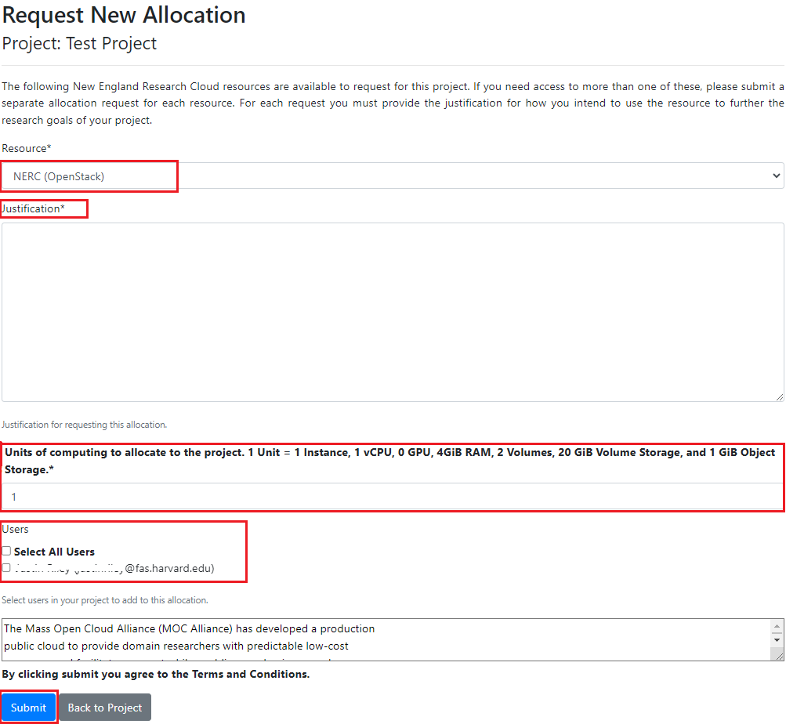
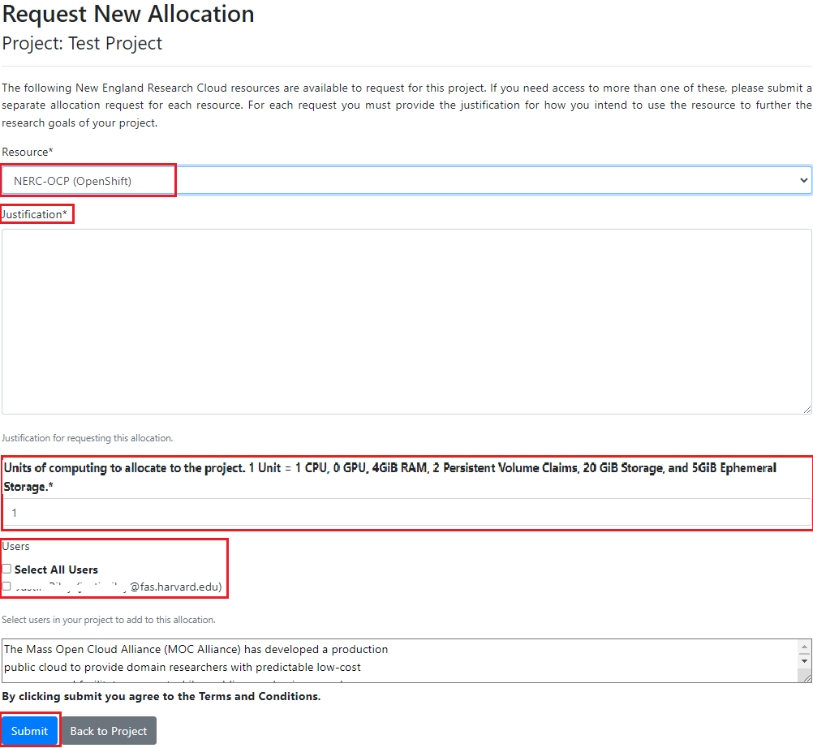

# Adding a new Resource Allocation to the project

If one resource allocation is not sufficient for a project, PI or project managers
may request additional allocations by clicking on the "Request Resource Allocation"
button on the Allocations section of the project details. This will show the page
where all existing users for the project will be listed on the bottom of the request
form. PIs can select desired user(s) to make the requested resource allocations
available on their NERC's OpenStack or OpenShift projects.

## Adding a new Resource Allocation to your OpenStack project

!!! warning "Important: Requested/Approved Allocated OpenStack Storage Quota & Cost"
    Ensure you choose **NERC (OpenStack)** in the Resource option and specify your
    anticipated computing units. Each allocation, whether requested or approved,
    will be billed based on the **pay-as-you-go** model. The exception is for
    **Storage quotas**, where the cost is determined by [your requested and approved
    allocation values](allocation-details.md#pi-and-manager-allocation-view-of-openstack-resource-allocation)
    to reserve storage from the total NESE storage pool. For **NERC (OpenStack)**
    Resource Allocations, storage quotas are specified by the "OpenStack Volume
    GB Quota" and "OpenStack Swift Quota in Gigabytes" allocation attributes. If
    you have common questions or need more information, refer to our
    [Billing FAQs](../../get-started/cost-billing/billing-faqs.md) for comprehensive
    answers. Keep in mind that you can easily scale and expand your current resource
    allocations within your project by following [this documentation](allocation-change-request.md#request-change-resource-allocation-attributes-for-openstack-project)
    later on.

## Adding a new Resource Allocation to your OpenShift project

!!! warning "Important: Requested/Approved Allocated OpenShift Storage Quota & Cost"
    Ensure you choose **NERC-OCP (OpenShift)** in the Resource option (**Always Remember:**
    the first option, i.e. **NERC (OpenStack)** is selected by default!) and specify
    your anticipated computing units. Each allocation, whether requested or approved,
    will be billed based on the **pay-as-you-go** model. The exception is for
    **Storage quotas**, where the cost is determined by
    [your requested and approved allocation values](allocation-details.md#pi-and-manager-allocation-view-of-openshift-resource-allocation)
    to reserve storage from the total NESE storage pool. For **NERC-OCP (OpenShift)**
    Resource Allocations, storage quotas are specified by the "OpenShift Request
    on Storage Quota (GB)" and "OpenShift Limit on Ephemeral Storage Quota (GB)"
    allocation attributes. If you have common questions or need more information,
    refer to our [Billing FAQs](../../get-started/cost-billing/billing-faqs.md)
    for comprehensive answers. Keep in mind that you can easily scale and expand
    your current resource allocations within your project by following
    [this documentation](allocation-change-request.md#request-change-resource-allocation-attributes-for-openshift-project)
    later on.

---
