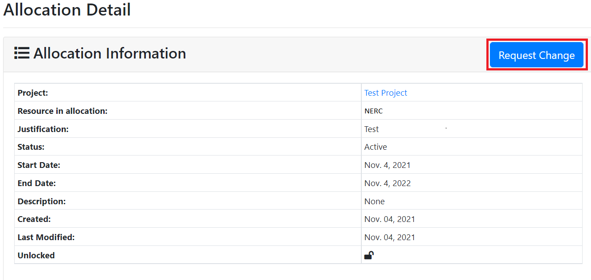
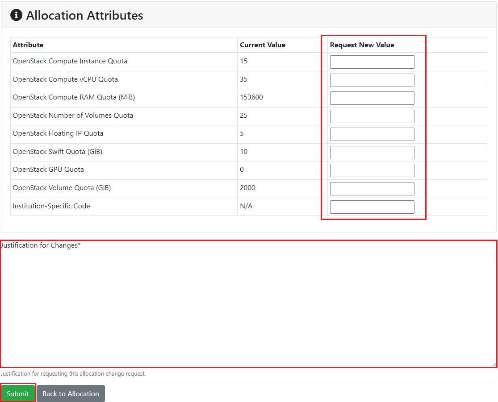
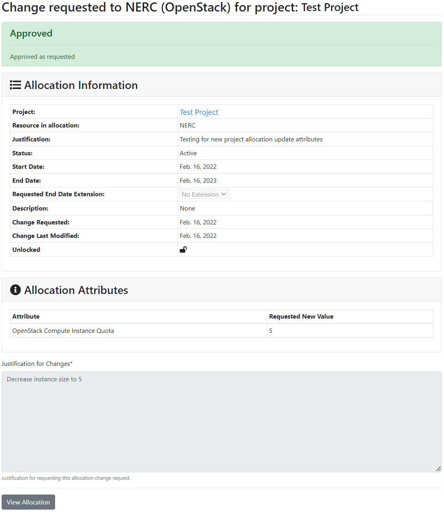
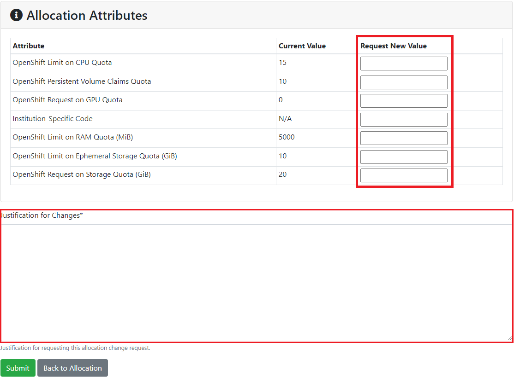
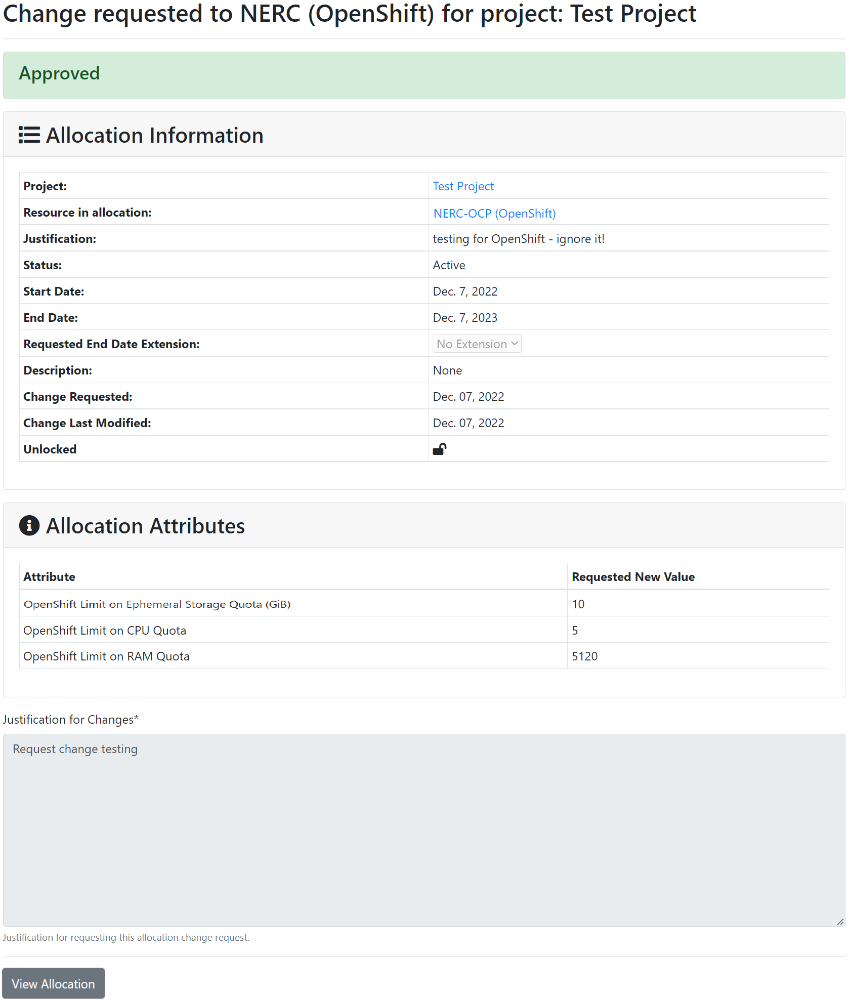

# Request change to Resource Allocation to an existing project

If past resource allocation is not sufficient for an existing project, PIs or project
managers can request a change by clicking "Request Change" button on project
resource allocation detail page as show below:

## Request Change Resource Allocation Attributes for OpenStack Project

This will bring up the detailed Quota attributes for that project as shown below:

!!! warning "Important: Requested/Approved Allocated OpenStack Storage Quota & Cost"
    For **NERC (OpenStack)** resource types, the **Storage quotas** are controlled
    by the values of the "OpenStack Volume Quota (GiB)" and "OpenStack Swift Quota
    (GiB)" quota attributes. The **Storage cost** is determined by [your requested
    and approved allocation values](allocation-details.md#pi-and-manager-allocation-view-of-openstack-resource-allocation)
    for these quota attributes. If you have common questions or need more information,
    refer to our [Billing FAQs](../../get-started/cost-billing/billing-faqs.md)
    for comprehensive answers.

PI or project managers can provide a new value for the individual quota attributes,
and give justification for the requested changes so that the NERC admin can review
the change request and approve or deny based on justification and quota change request.
Then submitting the change request, this will notify the NERC admin about it. Please
wait untill the NERC admin approves/ deny the change request to see the change on
your resource allocation for the selected project.

!!! info "Information"
    PI or project managers can put the new values on the textboxes for **ONLY**
    quota attributes they want to change others they can be left **blank** so those
    quotas will not get changed!

### Allocation Change Requests for OpenStack Project

Once the request is processed by the NERC admin, any user can view that request
change trails for the project by looking at the "Allocation Change Requests"
section that looks like below:

Any user can click on Action button to view the details about the change request.
This will show more details about the change request as shown below:

### How to Use GPU Resources in your OpenStack Project

!!! tip "Comparison Between CPU and GPU"
    To learn more about the key differences between CPUs and GPUs, please [read this](../../openstack/create-and-connect-to-the-VM/flavors.md#comparison-between-cpu-and-gpu).

A GPU instance is launched in the [same way](../../openstack/create-and-connect-to-the-VM/launch-a-VM.md)
as any other compute instance, with a few considerations to keep in mind:

- When launching a GPU based instance, be sure to select one of the
[GPU Tier](../../openstack/create-and-connect-to-the-VM/flavors.md#3-gpu-tier)
based flavor.

- You need to have sufficient resource quota to launch the desired flavor. Always
ensure you know which GPU-based flavor you want to use, then submit an
[allocation change request](#request-change-resource-allocation-attributes-for-openstack-project)
to adjust your current allocation to fit the flavor's resource requirements.

- We recommend using [ubuntu-22.04-x86_64](../../openstack/create-and-connect-to-the-VM/images.md#nerc-images-list)
as the image for your GPU-based instance because we have tested the NVIDIA driver
with this image and obtained good results. That said, it is possible to run a
variety of other images as well.

## Request Change Resource Allocation Attributes for OpenShift Project

!!! warning "Important: Requested/Approved Allocated OpenShift Storage Quota & Cost"
    For **NERC-OCP (OpenShift)** resource types, the **Storage quotas** are controlled
    by the values of the "OpenShift Request on Storage Quota (GiB)" and "OpenShift
    Limit on Ephemeral Storage Quota (GiB)" quota attributes. The **Storage cost**
    is determined by [your requested and approved allocation values](allocation-details.md#pi-and-manager-allocation-view-of-openshift-resource-allocation)
    for these quota attributes.

PI or project managers can provide a new value for the individual quota attributes,
and give justification for the requested changes so that the NERC admin can review
the change request and approve or deny based on justification and quota change request.
Then submitting the change request, this will notify the NERC admin about it. Please
wait untill the NERC admin approves/ deny the change request to see the change on
your resource allocation for the selected project.

!!! info "Information"
    PI or project managers can put the new values on the textboxes for **ONLY**
    quota attributes they want to change others they can be left **blank** so those
    quotas will not get changed!

### Allocation Change Requests for OpenShift Project

Once the request is processed by the NERC admin, any user can view that request
change trails for the project by looking at the "Allocation Change Requests"
section that looks like below:

Any user can click on Action button to view the details about the change request.
This will show more details about the change request as shown below:

### How to Use GPU Resources in your OpenShift Project

!!! tip "Comparison Between CPU and GPU"
    To learn more about the key differences between CPUs and GPUs, please [read this](../../openstack/create-and-connect-to-the-VM/flavors.md#comparison-between-cpu-and-gpu).

For OpenShift pods, we can specify different types of GPUs. Since OpenShift is not
based on flavors, we can customize the resources as needed at the pod level while
still utilizing GPU resources.

You can read about how to specify a pod to use a GPU [here](../../openshift/applications/scaling-and-performance-guide.md#how-to-specify-pod-to-use-gpu).

Also, you will be able to select a different GPU device for your workload, as
explained [here](../../openshift/applications/scaling-and-performance-guide.md#how-to-select-a-different-gpu-device).

---
