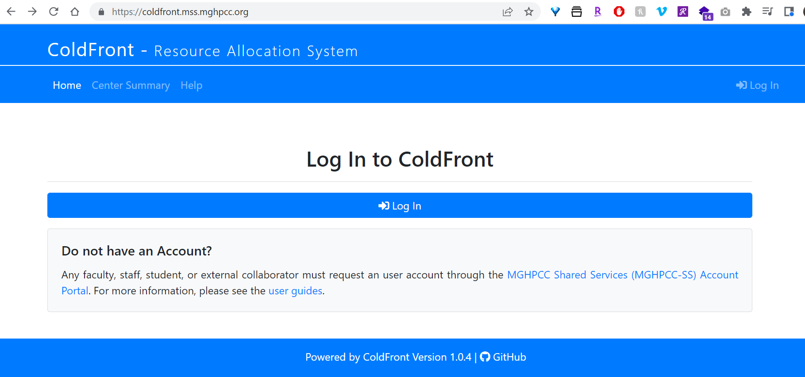
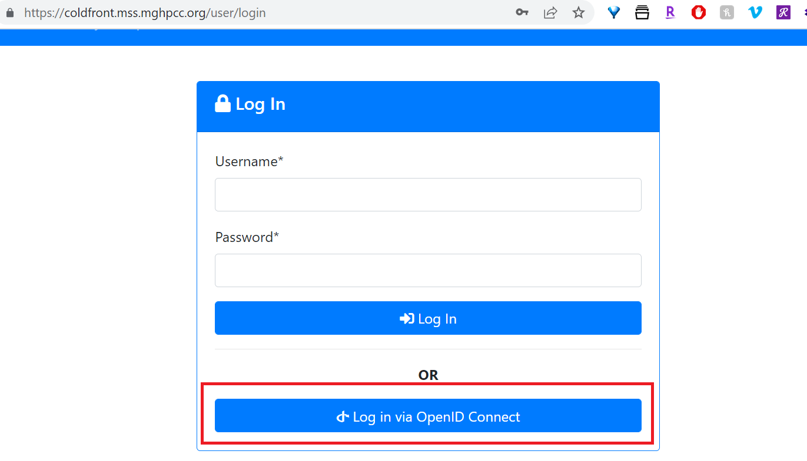
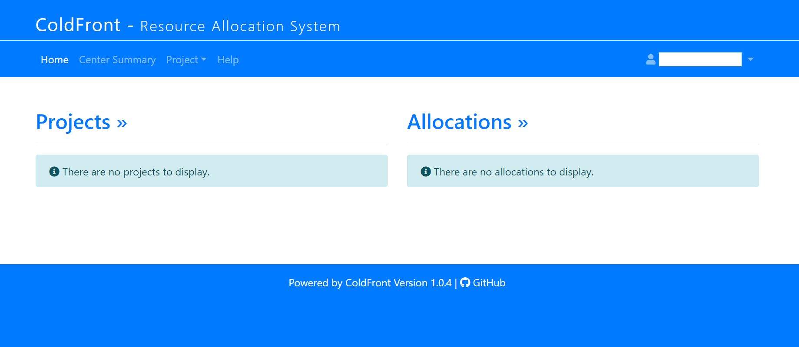

# What is NERC's ColdFront?

NERC uses [NERC's ColdFront interface](https://coldfront.mss.mghpcc.org/), an
open source resource allocation management system called
[ColdFront](https://github.com/ubccr/coldfront) to provide a single point-of-entry
for administration, reporting, and measuring scientific impact of NERC resources
for PI.

!!! tip "Learning ColdFront"

    A collection of [animated gifs](https://coldfront.readthedocs.io/en/latest/howto/demos/)
    showcasing common functions in ColdFront is available, providing helpful
    insights into how these features can be utilized.

## How to get access to NERC's ColdFront

Any users who had registerd their user accounts through the
[MGHPCC Shared Services (MGHPCC-SS) Account Portal](https://regapp.mss.mghpcc.org/)
also known as **"RegApp"** can get access to [NERC's ColdFront interface](https://coldfront.mss.mghpcc.org/).

General Users who are not PIs or Managers on a project see a read-only view of
the NERC's ColdFront as [described here](allocation-details.md#general-user-view).

Whereas, once a [PI Account request](https://nerc.mghpcc.org/pi-account-request/)
is granted, the PI will receive an email confirming the request approval and
how to connect NERC's ColdFront.

PI or project managers can use NERC's ColdFront as a self-service web-portal that
can see an administrative view of it as
[described here](../allocation/allocation-details.md#pi-and-manager-view) and can
do the following tasks:

-   **Only PI** can add a new project and archive any existing project(s)

-   Manage existing projects

-   Request allocations that fall under projects on NERC's resources such as clusters,
    cloud resources, servers, storage, and software licenses

-   Add/remove user access to/from allocated resources who is a member of the project
    without requiring system administrator interaction

-   Elevate selected users to 'manager' status, allowing them to handle some of the
    PI asks such as request new resource allocations, add/remove users to/from resource
    allocations, add project data such as grants and publications

-   Monitor resource utilization such as storage and cloud usage

-   Receive email notifications for expiring/renewing access to resources as well
    as notifications when allocations change status - i.e. Active, Active (Needs
    Renewal), Denied, Expired

-   Provide information such as grants, publications, and other reportable data for
    periodic review by center director to demonstrate need for the resources

## How to login to NERC's ColdFront?

[NERC's ColdFront interface](https://coldfront.mss.mghpcc.org/) provides users with
login page as shown here:

Please click on "**Log In**" button. Then, it will show the login interface as
shown below:

You need to click on "**Log in via OpenID Connect**" button. This will redirect you
to CILogon welcome page where you can select your appropriate Identity Provider
as shown below:

Once successful, you will be redirected to the ColdFront's main dashboard as shown
below:

---
