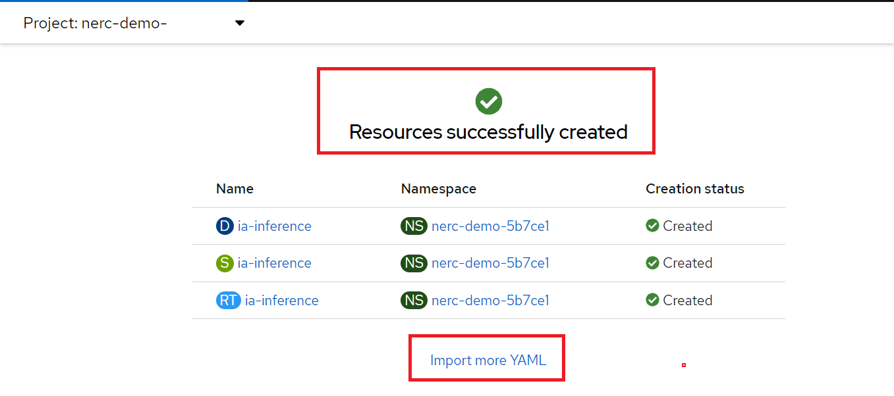
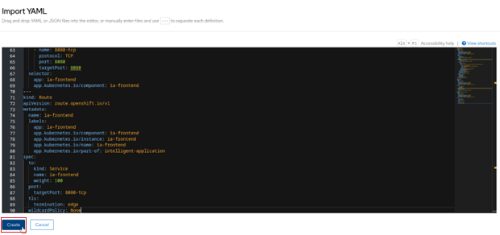
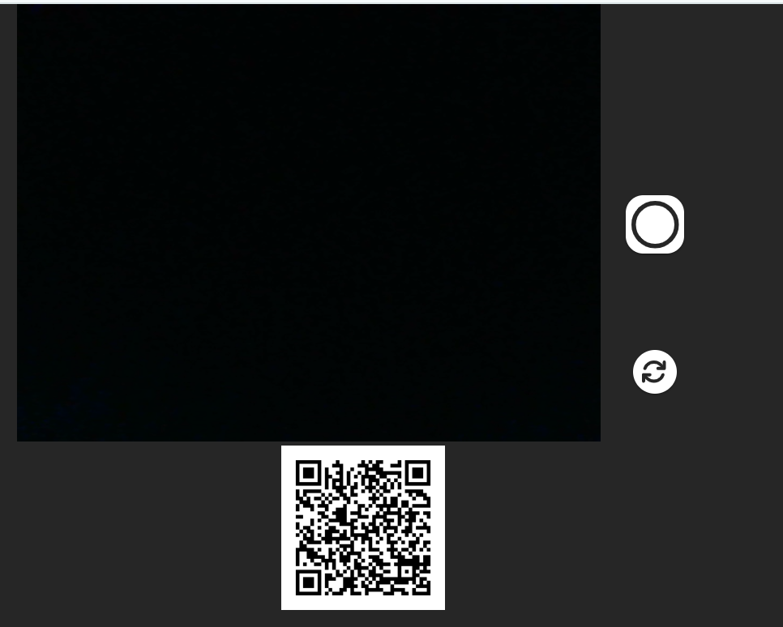
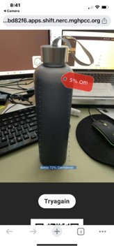

# Test the Model in the NERC RHOAI

Now that the [model server is ready](model-serving-in-the-rhoai.md) to receive requests,
we can test it.

!!! tip "How to get access to the NERC RHOAI Dashboard from JupyterLab Environment?"
    If you had closed the NERC RHOAI dashboard, you can access it from your currently
    opened JupyterLab IDE by clicking on *File -> Hub Control Panel* as shown below:

    

- In your project in JupyterLab, open the notebook `03_remote_inference.ipynb` and
follow the instructions to see how the model can be queried.

- Update the `grpc_url` as [noted before](model-serving-in-the-rhoai.md#deploy-the-model)
for the **the grpc URL value** from the deployed model on the NERC RHOAI Model server.

    

- Once you've completed the notebook's instructions, the object detection model
can isolate and recognize T-shirts, bottles, and hats in pictures, as shown below:

    

## Building and deploying an intelligent application

The application we are going to deploy is a simple example of how you can add an
intelligent feature powered by AI/ML to an application. It is a webapp that you
can use on your phone to discover coupons on various items you can see in a store,
in an augmented reality way.

### Architecture

The different components of this intelligent application are:

• **The Frontend**: a React application, typically running on the browser of your
phone,

• **The Backend**: a NodeJS server, serving the application and relaying API calls,

• **The Pre-Post Processing Service**: a Python FastAPI service, doing the image
pre-processing, calling the model server API, and doing the post-processing before
sending the results back.

• **The Model Server**: the RHOAI component serving the model as an API to do
the inference.

### Application Workflow Steps

1. Pass the image to the pre-post processing service

2. Pre-process the image and call the model server

3. Send back the inference result

4. Post-process the inference and send back the result

5. Pass the result to the frontend for display

### Deploy the application

The deployment of the application is really easy, as we already created for you
the necessary YAML files. They are included in the Git project we used for this
example project. You can find them in the **deployment** folder inside you JupyterLab
environment, or directly [here](https://github.com/nerc-project/nerc_rhoai_mlops/tree/main/deployment).

To deploy the Pre-Post Processing Service service and the Application:

- From your [NERC's OpenShift Web Console](https://console.apps.shift.nerc.mghpcc.org/),
navigate to your project corresponding to the *NERC RHOAI Data Science Project*,
and select the "Import YAML" button, the "plus" sign on the top right:

    

- Copy/Paste the content of the file `pre_post_processor_deployment.yaml` inside
the opened YAML editor. If you have named your model **coolstore** as instructed,
you're good to go. If not, modify the value on **line # 35** with the name you set.
You can then click the **Create** button as shown below:

    

- Once Resource is successfully created, you will see the following screen:

    

- Click on "Import more YAML" and Copy/Paste the content of the file `intelligent_application_deployment.yaml` inside the opened YAML editor. Nothing to change here, you can then click the **Create**
button as shown below:

    

- If both deployments are successful, you will be able to see both of them grouped
under "intelligent-application" on the **Topology View** menu, as shown below:

    

### Use the application

The application is relatively straightforward to use. Click on the URL for the
Route `ia-frontend` that was created.

You have first to allow it to use your camera, this is the interface you get:

You have:

- The current view of your camera.

- A button to take a picture as shown here:

    

- A button to switch from front to rear camera if you are using a phone:

    

- A **QR code** that you can use to quickly open the application on a phone
(much easier than typing the URL!):

    

When you take a picture, it will be sent to the `inference` service, and you will
see which items have been detected, and if there is a promotion available as shown
below:

### Tweak the application

There are two parameters you can change on this application:

- On the `ia-frontend` Deployment, you can modify the `DISPLAY_BOX` environment
variable from `true` to `false`. It will hide the bounding box and the inference
score, so that you get only the coupon flying over the item.

- On the `ia-inference` Deployment, the one used for pre-post processing, you can
modify the `COUPON_VALUE` environment variable. The format is simply an Array
with the value of the coupon for the 3 classes: bottle, hat, shirt. As you see,
these values could be adjusted in real time, and this could even be based on another
ML model!

---
