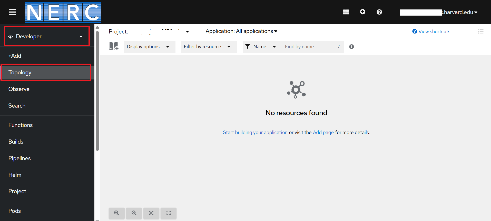
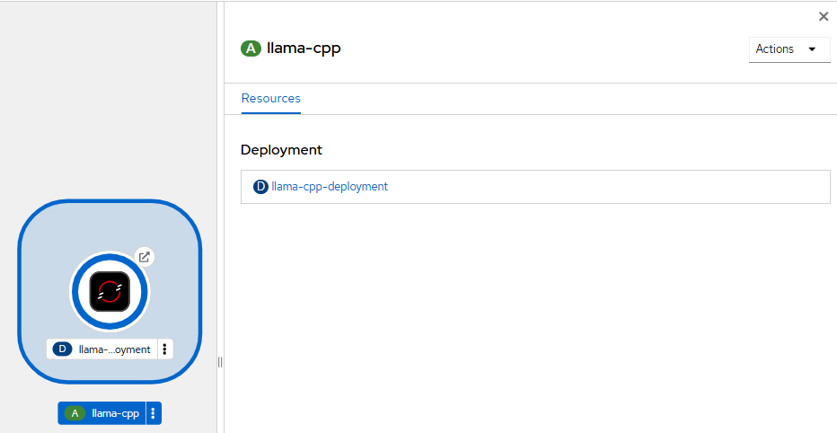
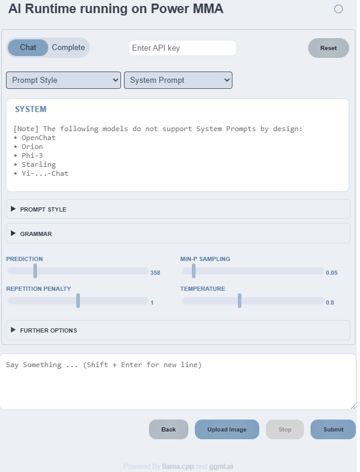
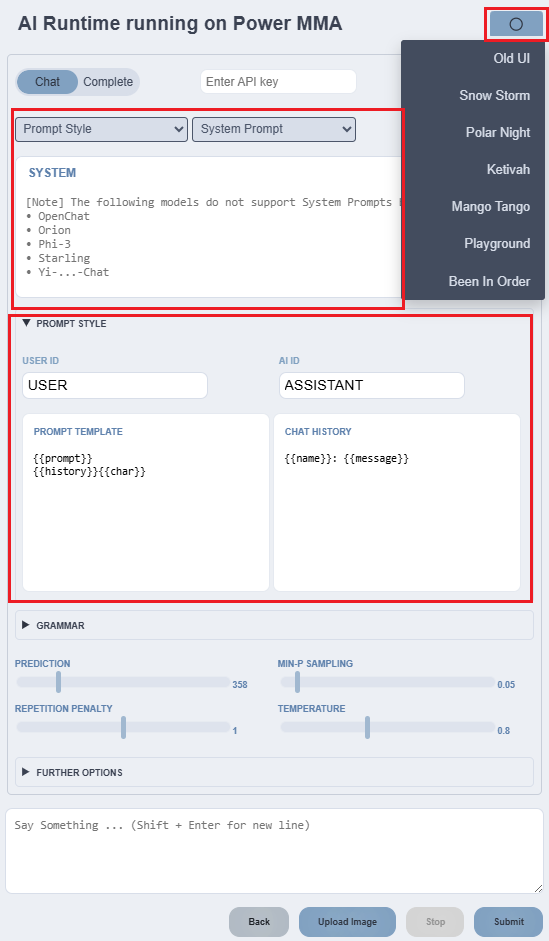
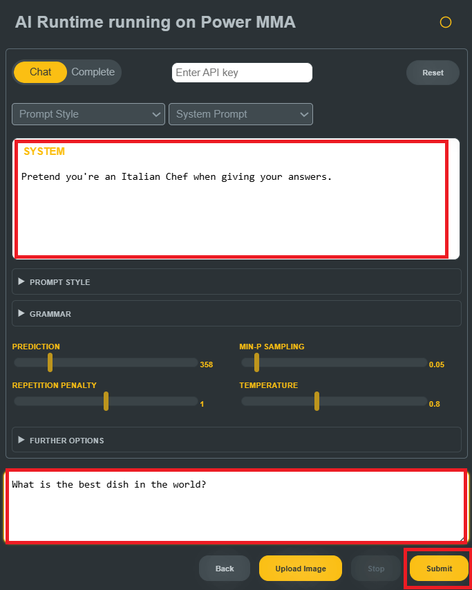
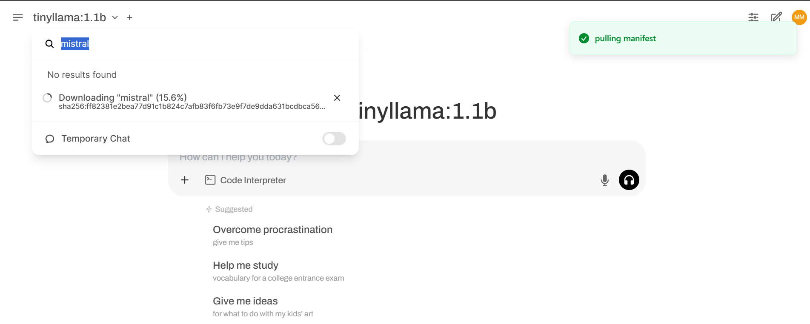

# Large Language Model (LLM) - Chat

[llama.cpp](https://github.com/ggml-org/llama.cpp) is an open-source software
library, primarily written in C++, designed for performing inference on various
large language models, including Llama. It is developed in collaboration with
the GGML project, a general-purpose tensor library.

The library includes command-line tools as well as a server featuring a simple
web interface.

## Standalone Deployment of `llama.cpp` Model Server

-   **Prerequisites**:

    Setup the OpenShift CLI (`oc`) Tools locally and configure the OpenShift CLI
    to enable `oc` commands. Refer to [this user guide](../../openshift/logging-in/setup-the-openshift-cli.md).

### Deployment Steps

1.  **Clone** or navigate to [this repository](https://github.com/nerc-project/llm-on-nerc.git).

    To get started, clone the repository using:

    ```sh
    git clone https://github.com/nerc-project/llm-on-nerc.git
    cd llm-on-nerc/llm-servers/llama.cpp/
    ```

    !!! tip "Read More"

        For more details, check out the [documentation](https://github.com/nerc-project/llm-on-nerc/blob/main/llm-servers/llama.cpp/README.md).

    In the `standalone` folder, you will find the following YAML files:

    i. `01-llama-cpp-pvc.yaml`: Creates a persistent volume to store the model file.
    Adjust the storage size according to your needs.

    ii. `02-llama-cpp-deployment.yaml`: Deploys the application.

    iii. `03-llama-cpp-service.yaml`, `04-llama-cpp-route.yaml`: Set up external
    access to connect to the Inference runtime Web UI.

2. Run this `oc` command: `oc apply -f ./standalone/.` to execute all YAML files
located in the **standalone** folder.

This deployment sets up a ready-to-use container runtime that pulls the
**Mistral-7B-Instruct-v0.3.Q4_K_M.gguf** pre-trained foundational model from
[Hugging Face](https://huggingface.co/mistralai/Mistral-7B-Instruct-v0.3).

!!! info "About Mistral-7B Model"

    *Mistral-7B* is a high-performance, relatively lightweight **LLM**, fully
    **open-source** under the **Apache 2.0** license. The *Mistral-7B-Instruct-v0.3*
    LLM is an instruct fine-tuned version of the *Mistral-7B-v0.3*.

## Opening the Inference runtime UI

1. Go to the [NERC's OpenShift Web Console](https://console.apps.shift.nerc.mghpcc.org).

2. Click on the **Perspective Switcher** drop-down menu and select **Developer**.

3. In the **Navigation Menu**, click **Topology**.

    

4. Click the button to open the llama-cpp-server UI:

    

    

    

    For a better experience customize the Chat UI and Prompt Style:

    

5. Test your inferencing by querying the inferencing runtime at the "Say Something"
    box:

    

6. Start Chatting:

    You can begin interacting with the LLM.

    

## Clean Up

To delete all resources if not necessary just run `oc delete -f ./standalone/.`
or `oc delete all,pvc -l app=llama-cpp`.

For more details, refer to this [documentation](https://github.com/nerc-project/llm-on-nerc/blob/main/llm-servers/llama.cpp/README.md).

!!! info "Another LLM Server with WebUI to Chat"

    Similar to `llama.cpp`, you can set up an example deployment of the [Ollama](https://github.com/ollama/ollama)
    server on the NERC OpenShift environment by following [these steps](https://github.com/nerc-project/llm-on-nerc/blob/main/llm-servers/ollama/README.md).

    Once successfully deployed, you can access the [Open WebUI](https://github.com/open-webui/open-webui)
    for Ollama, allowing you to log in, download new models, and start chatting!

    

!!! tip "Connecting LLM Clients to the Deployed LLM Providers"

    To learn more about how to use LLM clients i.e. **AnythingLLM** to connect
    with the locally deployed LLM providers on NERC OpenShift, please refer to
    this [detailed guide](LLM-client-AnythingLLM.md).

---
