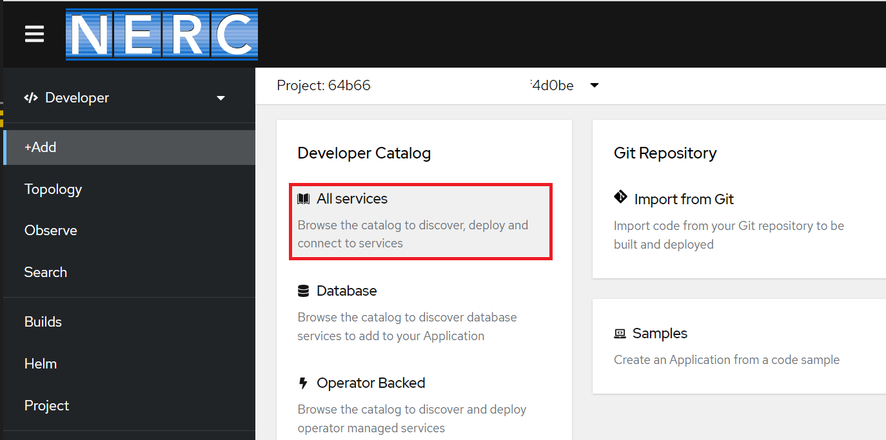

# Creating Your Own Developer Catalog Service

Here, we walk through the process of creating a simple RStudio Web Server using
an OpenShift Template, which bundles all the necessary resources required to run
it, such as ConfigMap, Pod, Route, Service, etc., and then initiate and deploy
the RStudio server from that template.

This example template file is readily accessible from the
[Git Repository](https://github.com/nerc-project/rstudio-testapp).

To get started, clone the repository using:

```sh
git clone https://github.com/nerc-project/rstudio-testapp.git
```

!!! note "More about Writing Templates"

    For more options and customization please [read this](https://docs.openshift.com/container-platform/4.17/applications/creating_applications/using-templates.html#templates-writing_using-templates).

1. Click the "Import YAML" button, represented by the "+" icon in the top navigation
   bar, or navigate to the **From Local Machine** section and select **Import YAML**,
   as shown below:

    

2. Either drag and drop `https://github.com/nerc-project/rstudio-testapp/blob/main/rstudio-server-template.yaml`
   or copy and paste the contents of this `rstudio-server-template.yaml` file into
   the opened Import YAML editor box.

    

3. You need to find the Developer Catalog section and then select **All services**
   option as shown below:

    

4. Then, you will be able to use the created Developer Catalog template by searching
   for "rstudio" on catalog as shown below:

    

5. Once selected by clicking the template, you will see Instantiate Template web
   interface as shown below:

    

6. Based on our template definition, we request that users input a preferred **PASSWORD**
    as a **variable** for the RStudio Server. The following interface will prompt
    you to enter the password, which will be used for logging into the RStudio Server.

    !!! note "Variables"

        This variable is mandatory for the application to be created.

        -   **PASSWORD** - Password for logging into RStudio Server

    

7. Once successfully initiated, you can either open the application URL using the
   **Open URL** icon as shown below or you can naviate to the route URL by
   navigating to the "Routes" section under the _Location_ path as shown below:

    

8. To get the Username to be used for login on RStudio Server, you need to click
   on running pod i.e. rstudio-server as shown below:

    

9. Then select the **YAML** section to find out the attribute value for **runAsUser**
   that is used as the Username while Sign in to RStudio Server as shown below:

    

10. Finally, you will be able to view the RStudio Web Server interface!

!!! note "Modifying uploaded templates"

    You can edit a template that has already been uploaded to your project:
    `oc edit template <template>`.

!!! Info "Another Example of Using an OpenShift Template to Setup an R Shiny Server"

    Here is another example of running an R Shiny Server using an OpenShift Template.  
    You can find more details [here](../../other-tools/R/r-shiny-server/running-rshiny-on-NERC.md#running-r-shiny-server-on-nerc-openshift).

---
