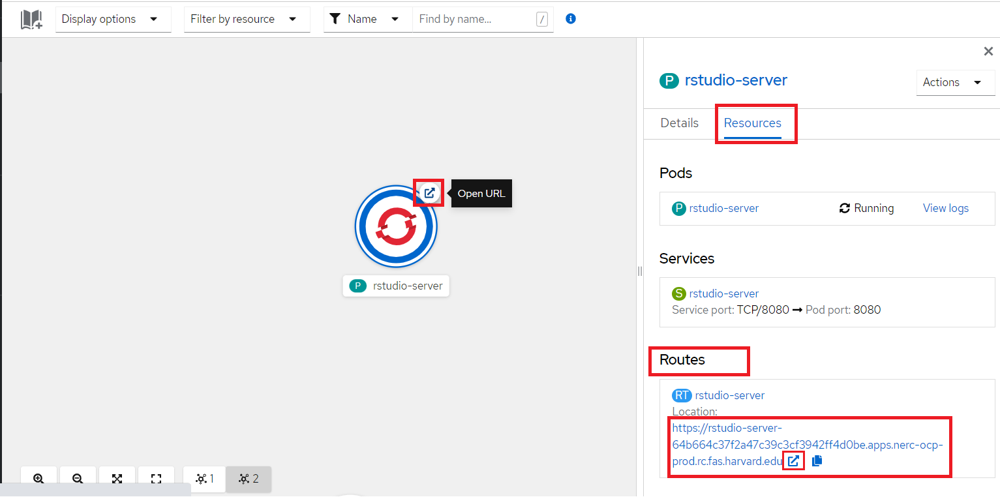

# Creating Your Own Developer Catalog Service

Here, we walk through the process of creating a simple RStudio web server template
that bundles all resources required to run the server i.e. ConfigMap, Pod, Route,
Service, etc. and then initiate and deploy application from that template.

This example template file is readily accessible from the
[Git Repository](https://github.com/nerc-project/rstudio-testapp).

!!! note "More about Writing Templates"

    For more options and customization please [read this](https://docs.openshift.com/container-platform/4.14/openshift_images/using-templates.html#templates-writing_using-templates).

1. Find the **From Local Machine** section and click on **Import YAML** as shown
   below:

    

2. On opened YAML editor paste the contents of the template copied from the
   `rstudio-server-template.yaml` file located at the provided [Git Repo](https://github.com/nerc-project/rstudio-testapp/blob/main/rstudio-server-template.yaml).

    

3. You need to find the Developer Catalog section and then select **All services**
   option as shown below:

    

4. Then, you will be able to use the created Developer Catalog template by searching
   for "RStudio" on catalog as shown below:

    

5. Once selected by clicking the template, you will see Instantiate Template web
   interface as shown below:

    

6. Based on our template definition, we request that users input a preferred password
   for the RStudio server so the following interface will prompt for your password
   that will be used during login to the RStudio server.

    

7. Once successfully initiated, you can either open the application URL using the
   **Open URL** icon as shown below or you can naviate to the Routes section and
   click on _Location_ path as shown below:

    

8. To get the Username to be used for login on RStudio server, you need to click
   on running pod i.e. rstudio-server as shown below:

    

9. Then select the **YAML** section to find out the attribute value for **runAsUser**
   that is used as the Username while Sign in to RStudio server as shown below:

    

10. Finally, you will be able to see the RStudio web interface!

!!! note "Modifying uploaded templates"

    You can edit a template that has already been uploaded to your project:
    `oc edit template <template>`

---
