# Scaling and Performance Guide

## Understanding Pod

Pods serve as the smallest unit of compute that can be defined, deployed, and
managed within the OpenShift Container Platform (OCP). The OCP utilizes the
[Kubernetes concept of a pod](https://kubernetes.io/docs/concepts/workloads/pods/),
which consists of one or more containers deployed together on a single host.

Pods are essentially the building blocks of a Kubernetes cluster, analogous to a
machine instance (either physical or virtual) for a container. Each pod is assigned
its own internal IP address, granting it complete ownership over its port space.
Additionally, containers within a pod can share local storage and network resources.

The lifecycle of a pod typically involves several stages: first, the pod is defined;
then, it is scheduled to run on a node within the cluster; finally, it runs until
its container(s) exit or until it is removed due to some other circumstance. Depending
on the cluster's policy and the exit code of its containers, pods may be removed
after exiting, or they may be retained to allow access to their container logs.

## Example pod configurations

The following is an example definition of a pod from a Rails application. It
demonstrates many features of pods, most of which are discussed in other topics
and thus only briefly mentioned here:

1. Pods can be "tagged" with one or more labels, which can then be used to select
and manage groups of pods in a single operation. The labels are stored in key/value
format in the `metadata` hash.

2. The pod restart policy with possible values `Always`, `OnFailure`, and `Never`.
The default value is `Always`. [Read this](https://docs.openshift.com/container-platform/4.10/nodes/pods/nodes-pods-configuring.html#nodes-pods-configuring-restart_nodes-pods-configuring)
to learn about "Configuring how pods behave after restart".

3. OpenShift Container Platform defines a security context for containers which
specifies whether they are allowed to run as privileged containers, run as a user
of their choice, and more. The default context is very restrictive but administrators
can modify this as needed.

4. `containers` specifies an array of one or more container definitions.

5. The container specifies where external storage volumes are mounted within the
container. In this case, there is a volume for storing access to credentials the
registry needs for making requests against the OpenShift Container Platform API.

6. Specify the volumes to provide for the pod. Volumes mount at the specified path.
Do not mount to the container root, `/`, or any path that is the same in the host
and the container. This can corrupt your host system if the container is sufficiently
privileged, such as the host `/dev/pts` files. It is safe to mount the host by using
`/host`.

7. Each container in the pod is instantiated from its own container image.

8. Pods making requests against the OpenShift Container Platform API is a common
enough pattern that there is a `serviceAccount` field for specifying which service
account user the pod should authenticate as when making the requests. This enables
fine-grained access control for custom infrastructure components.

9. The pod defines storage volumes that are available to its container(s) to use.
In this case, it provides an ephemeral volume for a secret volume containing the
default service account tokens. If you attach persistent volumes that have high
file counts to pods, those pods can fail or can take a long time to start.

!!! note "Viewing pods"
    You can refer to [this user guide](https://access.redhat.com/documentation/en-us/openshift_container_platform/4.14/html-single/nodes/index#nodes-pods-viewing)
    on how to view all pods, their usage statics (i.e. CPU, memory, and storage
    consumption) and logs in your project using the OpenShift CLI (`oc`) commands.

## Compute Resources

Each container running on a node consumes compute resources, which are measurable
quantities that can be requested, allocated, and consumed.

When authoring a pod configuration YAML file, you can optionally specify how much
CPU, memory (RAM), and local ephemeral storage each container needs in order to
better schedule pods in the cluster and ensure satisfactory performance as shown
below:

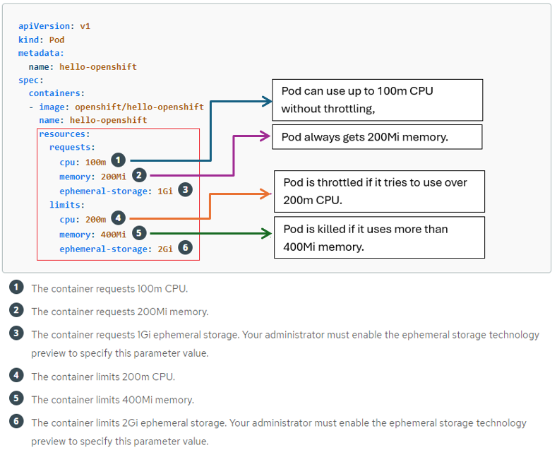

CPU and memory can be specified in a couple of ways:

- Resource **requests** and *limits* are optional parameters specified at the container
level. OpenShift computes a Pod's request and limit as the sum of requests and limits
across all of its containers. OpenShift then uses these parameters for scheduling
and resource allocation decisions.

    The **request** value specifies the min value you will be guaranteed. The request
    value is also used by the scheduler to assign pods to nodes.

    Pods will get the amount of **memory** they request. If they exceed their memory
    request, they could be killed if another pod happens to need this memory. Pods
    are only ever killed when using less memory than requested if critical system
    or high priority workloads need the memory utilization.

    Likewise, each container within a Pod is granted the **CPU** resources it requests,
    subject to availability. Additional CPU cycles may be allocated if resources
    are available and not required by other active Pods/Jobs.

    !!! note "Important Information"
        If a Pod's total requests are not available on a single node, then the Pod
        will remain in a *Pending* state (i.e. not running) until these resources
        become available.

- The **limit** value specifies the max value you can consume. Limit is the value
applications should be tuned to use. Pods will be memory, CPU throttled when they
exceed their available memory and CPU limit.

CPU is measured in units called millicores, where 1000 millicores ("m") = 1 vCPU
or 1 Core. Each node in a cluster inspects the operating system to determine the
amount of CPU cores on the node, then multiplies that value by 1000 to express its
total capacity. For example, if a node has *2 cores*, the node's CPU capacity would
be represented as *2000m*. If you wanted to use *1/10 of a single core*, it would
be represented as *100m*.

Memory and ephemeral storage are measured in bytes. In addition, it may be used
with SI suffixes (E, P, T, G, M, K) or their power-of-two-equivalents (Ei, Pi, Ti,
Gi, Mi, Ki).

!!! warning "What happens if I did not specify the Compute Resources on Pod YAML?"
    If you don't specify the compute resources for your objects i.e. containers,
    to restrict them from running with unbounded compute resources from our cluster
    the objects will use the limit ranges specified for your project namespace.
    With limit ranges, we restrict resource consumption for specific objects in
    a project. You can also be able to view the current limit range for your project
    by going into the **Administrator** perspective and then navigating into the
    "LimitRange details" as shown below:

    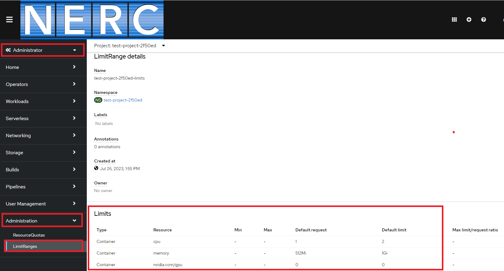

## How to specify pod to use GPU?

So from a **Developer** perspective, the only thing you have to worry about is
asking for GPU resources when defining your pods, with something like:

    spec:
      containers:
      - name: app
        image: ...
        resources:
          requests:
            memory: "64Mi"
            cpu: "250m"
            nvidia.com/gpu: 1
          limits:
            memory: "128Mi"
            cpu: "500m"

In the sample Pod Spec above, you can allocate GPUs to pods by specifying the GPU
resource `nvidia.com/gpu` and indicating the desired number of GPUs. This number
should not exceed the GPU quota specified by the value of the
"**OpenShift Request on GPU Quota**" attribute that has been approved for your
"**NERC-OCP (OpenShift)**" resource allocation on NERC's ColdFront as
[described here](../../get-started/allocation/allocation-details.md#pi-and-manager-allocation-view-of-openshift-resource-allocation).

The "resources" section under "containers" with the `nvidia.com/gpu` specification
indicates the number of GPUs you want in this container. Below is an example of
a running pod YAML that requests the GPU device with a count of 2:

    apiVersion: v1
    kind: Pod
    metadata:
      name: gpu-pod
    spec:
      restartPolicy: Never
      containers:
        - name: cuda-container
          image: nvcr.io/nvidia/k8s/cuda-sample:vectoradd-cuda10.2
          command: ["sleep"]
          args: ["infinity"]
          resources:
            limits:
              nvidia.com/gpu: 2
      nodeSelector:
        nvidia.com/gpu.product: NVIDIA-A100-SXM4-40GB

On opened YAML editor paste the contents of the above given pod YAML as shown below:

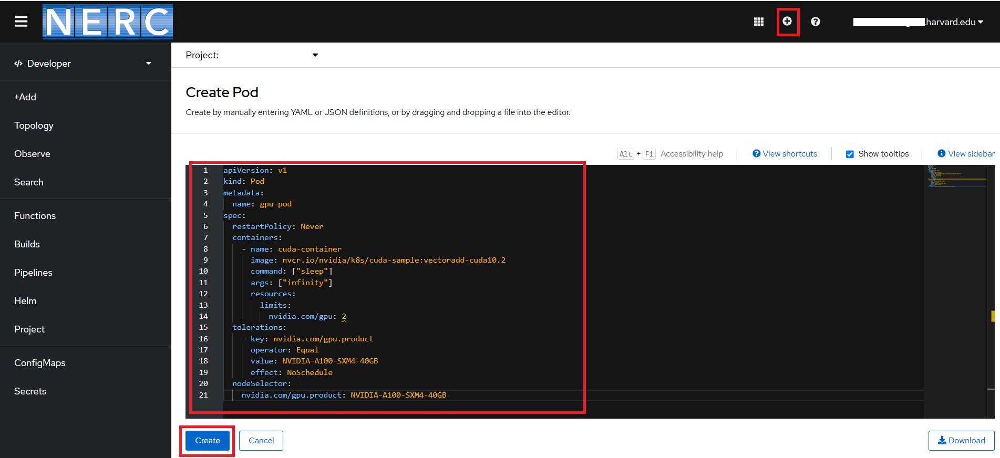

After the pod is running, navigate to the pod details and execute the following
command in the **Terminal** to view the currently available NVIDIA GPU devices:

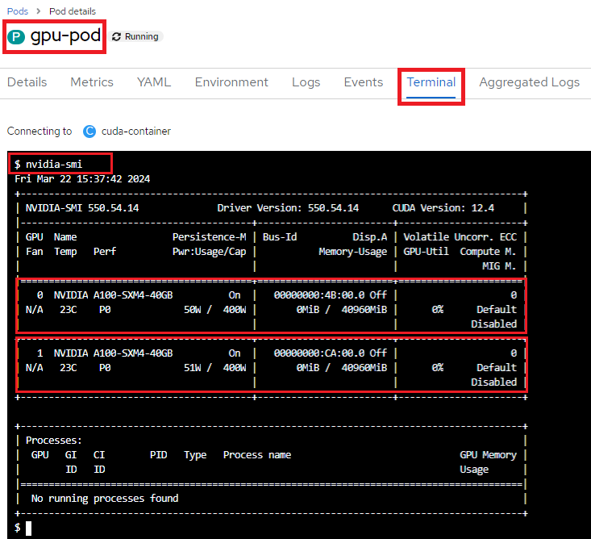

Additionally, you can execute the following command to narrow down and retrieve
the name of the GPU device:

    nvidia-smi --query-gpu=gpu_name --format=csv,noheader --id=0 | sed -e 's/ /-/g'

    NVIDIA-A100-SXM4-40GB

### How to select a different GPU device for your container?

We can specify information about the GPU product type, family, count, and so on,
as shown in the Pod Spec above. Also, these node labels can be used in the Pod Spec
to schedule workloads based on criteria such as the GPU device name, as shown under
*nodeSelector* as shown below:

    apiVersion: v1
    kind: Pod
    metadata:
      name: gpu-pod2
    spec:
      restartPolicy: Never
      containers:
        - name: cuda-container
          image: nvcr.io/nvidia/k8s/cuda-sample:vectoradd-cuda10.2
          command: ["sleep"]
          args: ["infinity"]
          resources:
            limits:
              nvidia.com/gpu: 1
      nodeSelector:
        nvidia.com/gpu.product: Tesla-V100-PCIE-32GB

When you run the `nvidia-smi` command in the terminal, you can observe the
availability of the different V100 NVIDIA GPU device, as shown below:

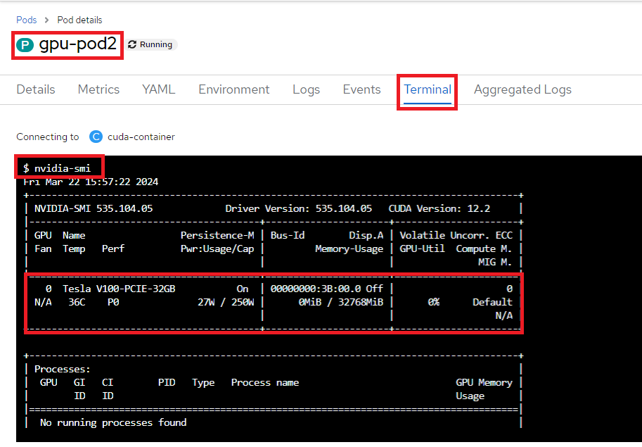

## Scaling

Scaling defines the number of pods or instances of the application you want to
deploy. Bare pods not managed by a replication controller will not be rescheduled
in the event of a node disruption. You can deploy your application using `Deployment`
or `Deployment Config` objects to maintain the desired number of healthy pods and
manage them from the web console. You can create [deployment strategies](https://access.redhat.com/documentation/en-us/openshift_container_platform/4.10/html/building_applications/deployments#deployment-strategies)
that help reduce downtime during a change or an upgrade to the application. For
more information about deployment, please [read this](https://docs.openshift.com/container-platform/4.10/applications/deployments/what-deployments-are.html#what-deployments-are-build-blocks).

!!! note "Benefits of Scaling"
    This will allow for a quicker response to peaks in demand, and reduce costs by
    automatically scaling down when resources are no longer needed.

## Scaling application pods, resources and observability

The Topology view provides the details of the deployed components in the
**Overview** panel. You can use the **Details**, **Resources** and **Observe**
tabs to scale the application pods, check build status, services, routes, metrics,
and events as follows:

Click on the component node to see the *Overview* panel to the right.

Use the **Details** tab to:

- Scale your pods using the up and down arrows to increase or decrease the number
of pods or instances of the application manually as shown below:

    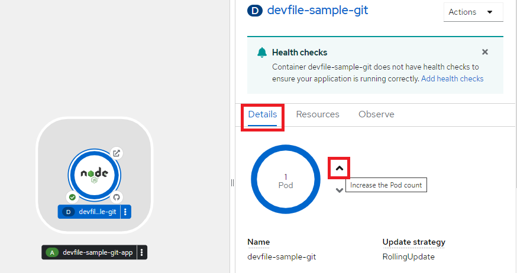

    **Alternatively,** we can easily configure and modify the pod counts by right-click
    the application to see the edit options available and selecting the *Edit Pod
    Count* as shown below:

    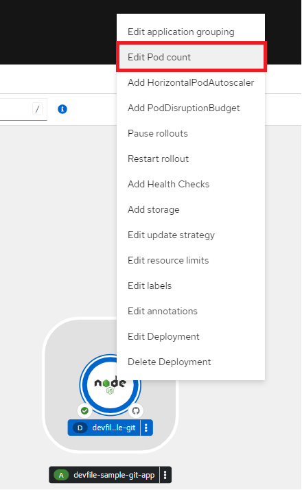

- Check the Labels, Annotations, and Status of the application.

Click the **Resources** tab to:

- See the list of all the pods, view their status, access logs, and click on the
pod to see the pod details.

- See the builds, their status, access logs, and start a new build if needed.

- See the services and routes used by the component.

Click the **Observe** tab to:

- See the metrics to see CPU usage, Memory usage and Bandwidth consumption.

- See the Events.

    !!! note "Detailed Monitoring your project and application metrics"
        On the left navigation panel of the **Developer** perspective, click
        **Observe** to see the Dashboard, Metrics, Alerts, and Events for your project.
        For more information about Monitoring project and application metrics
        using the Developer perspective, please
        [read this](https://docs.openshift.com/container-platform/4.10/applications/odc-monitoring-project-and-application-metrics-using-developer-perspective.html).

## Scaling manually

To manually scale a `DeploymentConfig` object, use the `oc scale` command.

    oc scale dc <dc_name> --replicas=<replica_count>

For example, the following command sets the replicas in the **frontend** `DeploymentConfig`
object to **3**.

    oc scale dc frontend --replicas=3

The number of replicas eventually propagates to the desired and current state of
the deployment configured by the `DeploymentConfig` object `frontend`.

!!! info "Scaling applications based on a schedule (Cron)"
    You can also integrate schedule based scaling uses OpenShift/Kubernetes native
    resources called **CronJob** that execute a task periodically (date + time)
    written in [Cron](https://en.wikipedia.org/wiki/Cron) format. For example,
    scaling an app to 5 replicas at 0900; and then scaling it down to 1 pod at 2359.
    To learn more about this, please refer to [this blog post](https://www.redhat.com/en/blog/3-methods-of-auto-scaling-openshift-applications).

## AutoScaling

We can configure automatic scaling, or autoscaling, for applications to match
incoming demand. This feature automatically adjusts the scale of a replication
controller or deployment configuration based on metrics collected from the pods
belonging to that replication controller or deployment configuration. You can
create a Horizontal Pod Autoscaler (HPA) for any deployment, deployment config,
replica set, replication controller, or stateful set.

For instance, if an application receives no traffic, it is scaled down to the
minimum number of replicas configured for the application. Conversely, replicas
can be scaled up to meet demand if traffic to the application increases.

### Understanding Horizontal Pod Autoscalers (HPA)

You can create a horizontal pod autoscaler to specify the minimum and maximum
number of pods you want to run, as well as the *CPU utilization* or *memory utilization*
your pods should target.

| Metric             | Description                                                                                |
|--------------------|--------------------------------------------------------------------------------------------|
| CPU Utilization    | Number of CPU cores used. Can be used to calculate a percentage of the pod’s requested CPU.|
| Memory Utilization | Amount of memory used. Can be used to calculate a percentage of the pod’s requested memory.|

After you create a horizontal pod autoscaler, OCP begins to query the CPU and/or
memory resource metrics on the pods. When these metrics are available, the HPA
computes the ratio of the current metric utilization with the desired metric
utilization, and scales up or down accordingly. The query and scaling occurs at
a regular interval, but can take one to two minutes before metrics become available.

For *replication controllers*, this scaling corresponds directly to the replicas
of the *replication controller*. For *deployment configurations*, scaling corresponds
directly to the replica count of the *deployment configuration*. Note that autoscaling
applies only to the latest deployment in the `Complete` phase.

For more information on how the HPA works, read [this documentation](https://docs.openshift.com/container-platform/4.14/nodes/pods/nodes-pods-autoscaling.html#nodes-pods-autoscaling-workflow-hpa_nodes-pods-autoscaling).

!!! warning "Very Important Note"
    To implement the HPA, all targeted pods must have a **Resource limits**
    set on their containers. The HPA will not have CPU and Memory metrics until
    Resource limits are set. CPU request and limit must be set before CPU utilization
    can be set. Memory request and limit must be set before Memory utilization
    can be set.

### Resource Limit

**Resource limits** control how much CPU and memory a container will consume on
a node. You can specify a limit on how much memory and CPU an container can consume
in both request and limit values. You can also specify the min request and max
limit of a given container as well as the max ratio between request and limit.
we can easily configure and modify the *Resource Limit* by right-click the
application to see the edit options available as shown below:

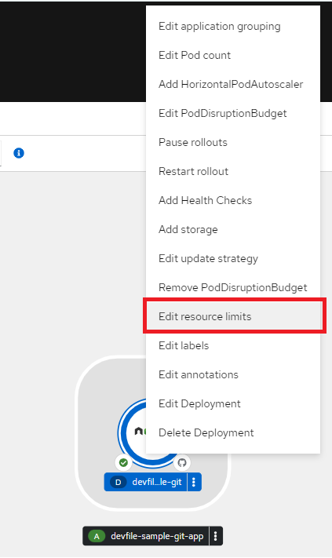

Then selecting the *Edit resource limits* link to set the amount of CPU and Memory
resources a container is guaranteed or allowed to use when running. In the pod
specifications, you must specify the resource requests, such as CPU and memory as
[described here](#compute-resources).

The HPA uses this specification to determine the resource utilization and then
scales the target up or down. Utilization values are calculated as a percentage
of the resource requests of each pod. Missing resource request values can affect
the optimal performance of the HPA.

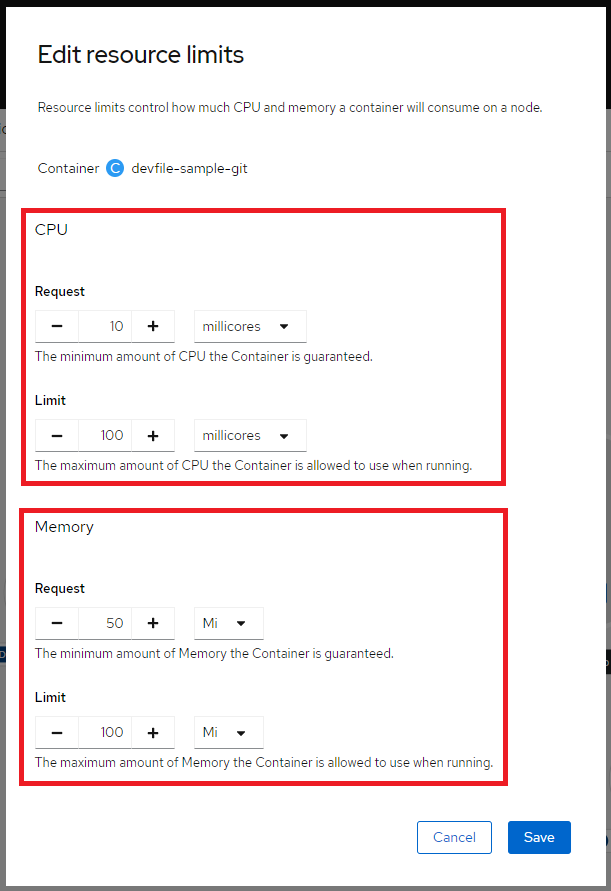

### Creating a horizontal pod autoscaler by using the web console

From the web console, you can create a HPA that specifies the minimum and maximum
number of pods you want to run on a Deployment or DeploymentConfig object. You
can also define the amount of CPU or memory usage that your pods should target.
The HPA increases and decreases the number of replicas between the minimum and
maximum numbers to maintain the specified CPU utilization across all pods.

#### Steps

##### To create an HPA in the web console

- In the **Topology** view, click the node to reveal the side pane.

- From the *Actions* drop-down list, select **Add HorizontalPodAutoscaler** as
shown below:

    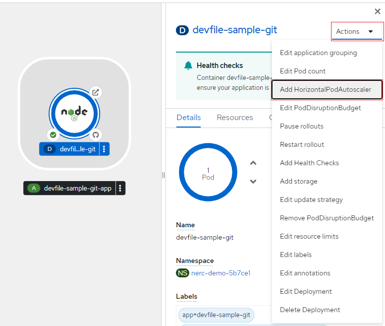

- This will open the **Add HorizontalPodAutoscaler** form as shown below:

    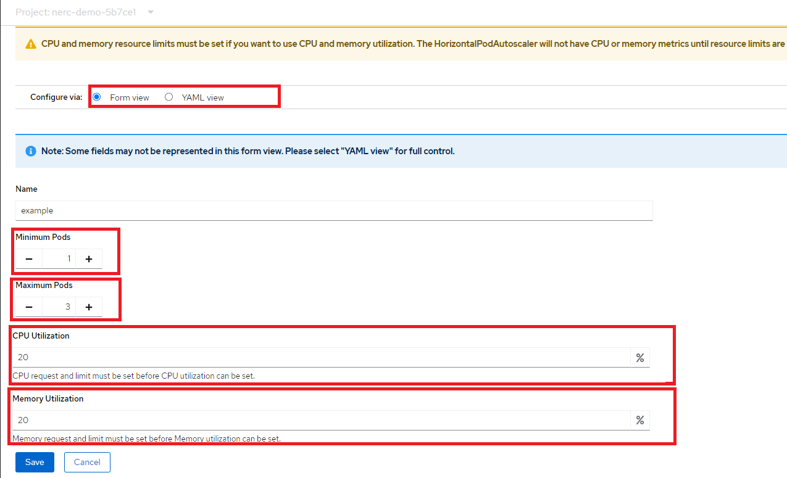

    !!! note "Configure via: Form or YAML View"
        While creating or editing the horizontal pod autoscaler in the web console,
        you can switch from **Form view** to **YAML view**.

- From the **Add HorizontalPodAutoscaler** form, define the name, minimum and maximum
pod limits, the CPU and memory usage, and click **Save**.

##### To edit an HPA in the web console

- In the **Topology** view, click the node to reveal the side pane.

- From the **Actions** drop-down list, select **Edit HorizontalPodAutoscaler** to
open the **Edit Horizontal Pod Autoscaler** form.

- From the **Edit Horizontal Pod Autoscaler** form, edit the minimum and maximum
pod limits and the CPU and memory usage, and click **Save**.

##### To remove an HPA in the web console

- In the **Topology** view, click the node to reveal the side panel.

- From the **Actions** drop-down list, select **Remove HorizontalPodAutoscaler**.

- In the confirmation pop-up window, click **Remove** to remove the HPA.

!!! tip "Best Practices"
    Read [this document](https://docs.openshift.com/container-platform/4.10/nodes/pods/nodes-pods-autoscaling.html#nodes-pods-autoscaling-best-practices-hpa_nodes-pods-autoscaling)
    to learn more about best practices regarding Horizontal Pod Autoscaler (HPA)
    autoscaling.

---
