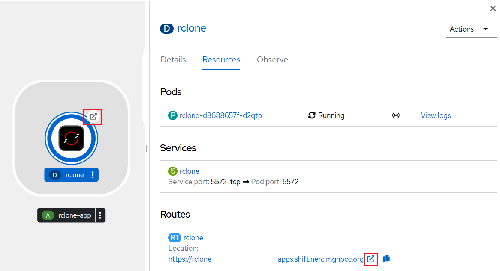
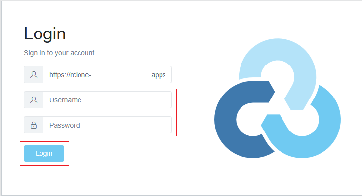
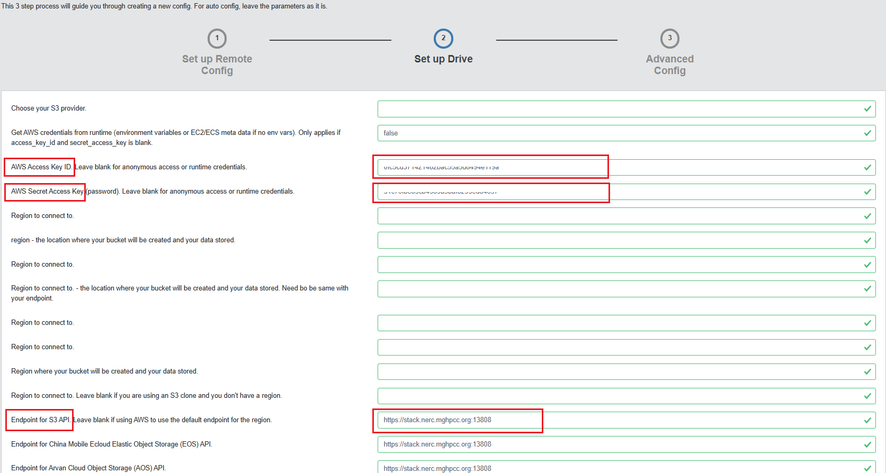
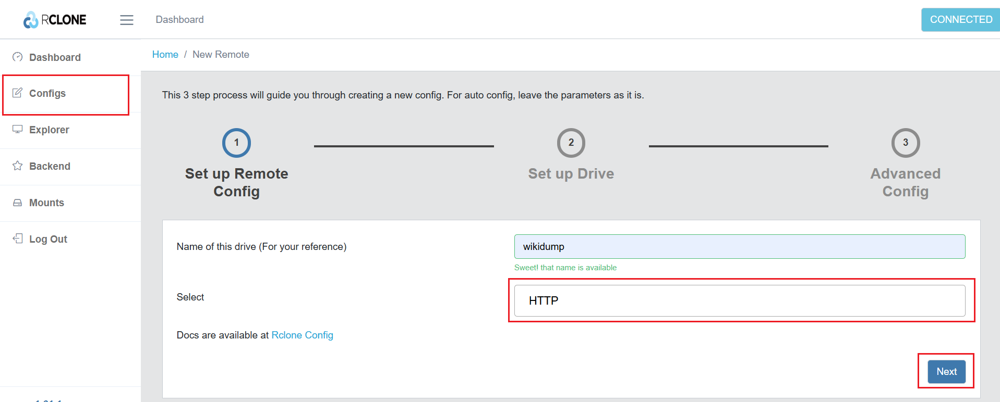
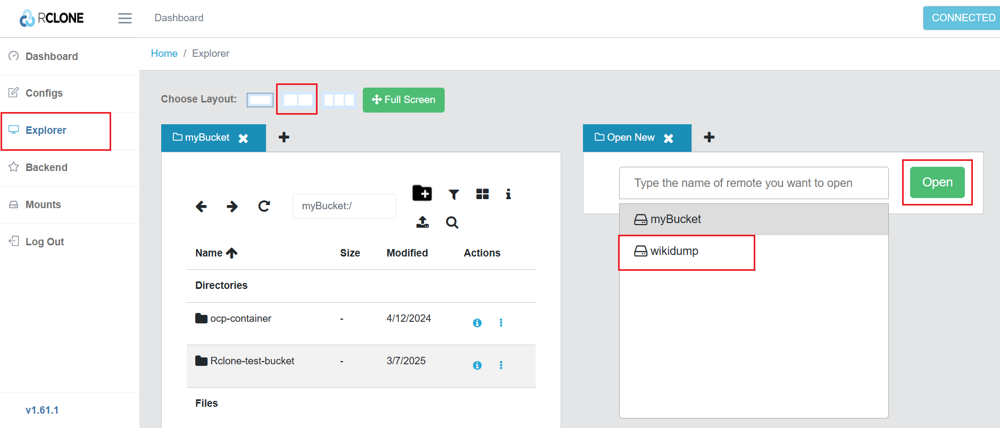
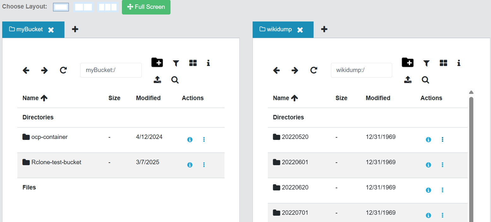
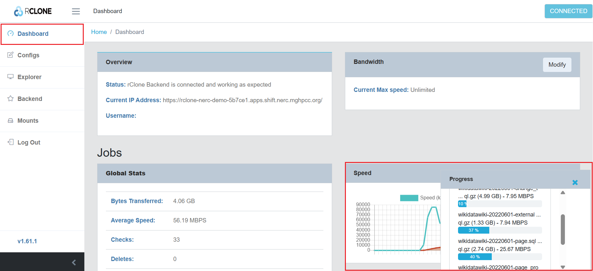

# Rclone

[Rclone](https://rclone.org/) is a program to manage files on cloud storage. It
is a feature-rich alternative to cloud vendors' web storage interfaces. Different
cloud storage products support rclone including S3 object stores, business &
consumer file storage services, as well as standard transfer protocols. Rclone
is mature, open-source software originally inspired by **rsync** and written in Go.

## Deploying Rclone on NERC OpenShift

-   **Prerequisites**

    Setup the OpenShift CLI Tools locally and configure the OpenShift CLI to enable
    `oc` commands. Refer to [this user guide](../../openshift/logging-in/setup-the-openshift-cli.md).

### Steps

1.  **Clone** or navigate to [this repository](https://github.com/nerc-project/rclone-web-on-openshift.git).

2. Run this `oc` command: `oc apply -f ./standalone/deploy/.` to execute all YAML
files located in the **standalone/deploy** folder.

In the `standalone/deploy` folder, you will find the following YAML files:

    i. `01-pvc.yaml`: Creates a persistent volume to store the configuration.

    ii. `02-deployment.yaml`: Deploys the application.

    !!! danger "Very Important: Change provided admin username and password"

        Modify the admin account and password to restrict access (highly recommended).

    iii. `03-service.yaml`, `04-route.yaml`: Set up external access to connect to the Web UI.

## Configuration

-   You will see the `rclone-app` application on OpenShift Web Dashboard.

-   Once the application is deployed and the route is set up, it can be accessed
    at a web URL similar to `http://rclone-<mynamespace>.apps.shift.nerc.mghpcc.org`
    by clicking any one of the links as shown here:

    

-   Log in to the Rclone by entering the username and password setup in `02-deployment.yaml`
    as [environment variables](https://github.com/nerc-project/rclone-web-on-openshift/blob/main/standalone/deploy/02-deployment.yaml#L40-L43).

    

-   Create a configuration for your endpoints.

    !!! info "Rclone to connect the NERC OpenStack Object Storage"

        For example, here we are setting up an S3 configuration to connect to a
        container (bucket) on the NERC OpenStack. You must have already created
        this container and gathered all the necessary details: the endpoint,
        access key, secret key, and container name. Refer to [this guide](../../openstack/persistent-storage/object-storage.md#configuring-the-aws-cli)
        to learn how to retrieve this information from your NERC OpenStack project.

    i. In Rclone, click on "**Configs**" Menu.  

    ii. Click on "Create a New Config" button to create a new Remote.

    

    iii. Create a new configuration, give it a name i.e. `myBucket`, and select
    "Amazon S3 Compliant Storage Providers...", which support the NERC OpenStack
    Object Storage/ Swift.

    

    iv. Enter the connection details by providing the **AWS Access Key ID**,
    **AWS Secret Access Key**, and the **S3 Endpoint** under
    _"Endpoint for S3 API"_ (e.g., `https://stack.nerc.mghpcc.org:13808`, the
    default S3 Endpoint URL for NERC OpenStack Object Storage). The final value
    is automatically copied into other fields - this is expected behavior.

    !!! info "Very Important: Endpoint for S3 API for the NERC Object Storage/ Swift"

        The default endpoint for S3 API for the NERC Object Storage/ Swift is `https://stack.nerc.mghpcc.org:13808`.

    

    v. Finalize the config by clicking on "Next" at the bottom.

    Now that you have completed the remote setup, go to the **Explorer** menu,
    select the remote, and start browsing!

    

## Usage

In this simple example, we will transfer a sample dump from Wikipedia. Wikimedia
publishes these dumps daily, and they are mirrored by various organizations.

In a "standard" setup, loading this data into your object store wouldn't be very
practical, as it often requires downloading it locally first before uploading it
to your storage.

This is how we can do it with Rclone:

-   Create another remote of type "HTTP" named as `wikidump`.

    

-   Enter the address of one of the mirrors. Here we use `https://dumps.wikimedia.your.org/wikidatawiki/`.

    

-   Open the Explorer view, set it in dual-pane layout:

    

    In the first pane, open your first remote, i.e., `myBucket`, and in the other
    pane, open the remote `wikidump`, which should look like this:

    

    Browse to the folder you want, select a file or folder, and simply drag and
    drop it from `wikidump` to your NERC OpenStack Object Storage container/bucket.

    For a more interesting test, try selecting a larger file!

-   Click on the "Dashboard" menu, where you will see the file transfer happening
    in the background.

    

That's it! No installation required, high-speed optimized transfer, and you can
even perform multiple transfers in the background...

---
