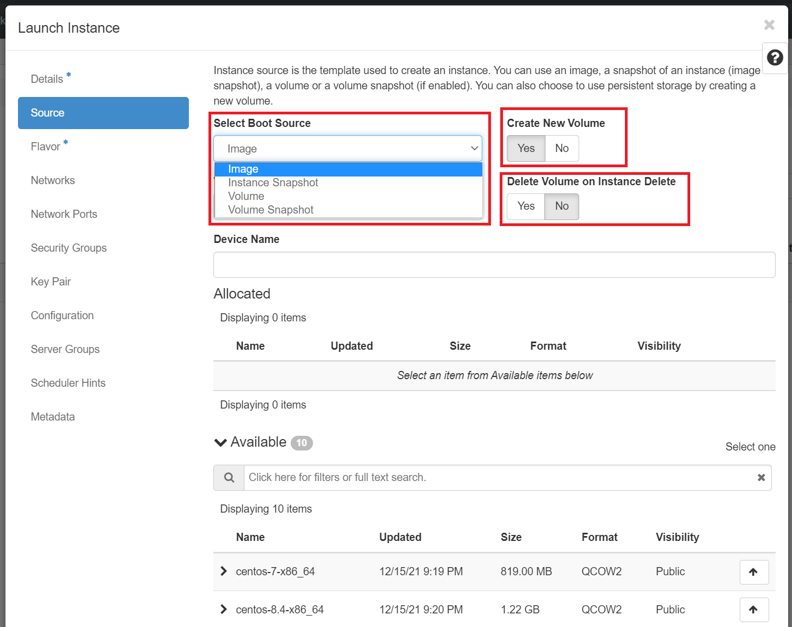
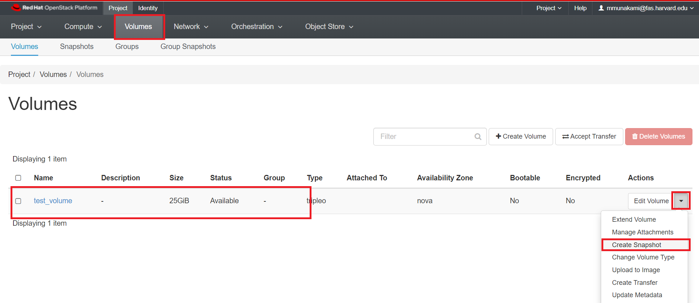
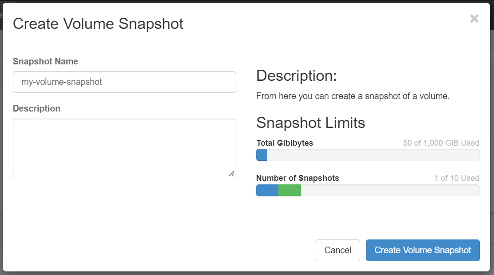
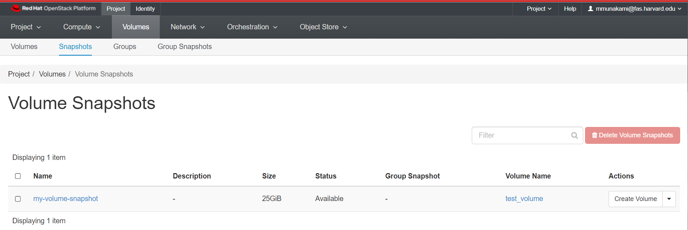
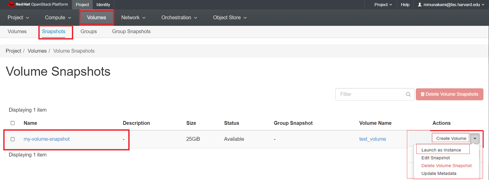
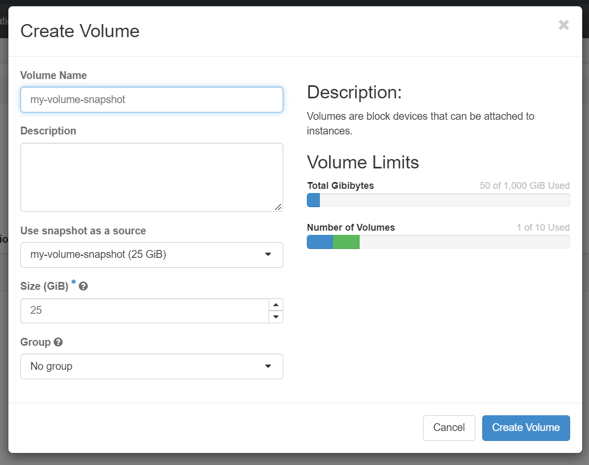
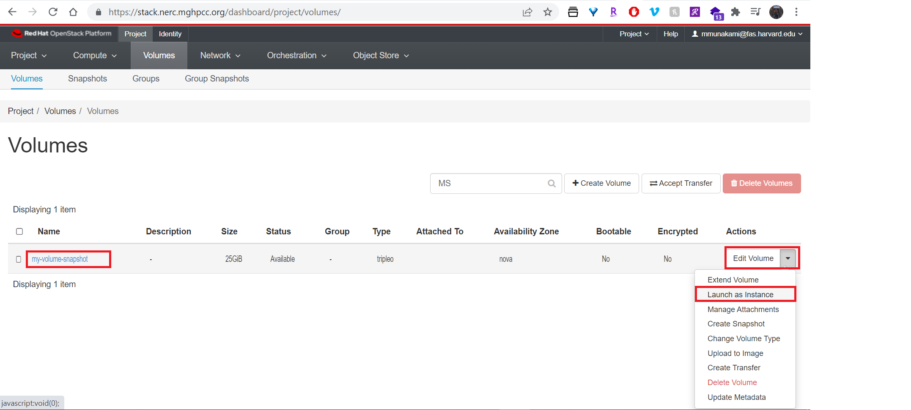

# Backup with snapshots

When you start a new instance, you can choose the Instance Boot Source from the
following list:

- boot from image
- boot from instance snapshot
- boot from volume
- boot from volume snapshot

In its default configuration, when the instance is launched from an **Image** or
an **Instance Snapshot**, the choice for utilizing persistent storage is configured
by selecting the **Yes** option for "Create New Volume". Additionally, the "Delete
Volume on Instance Delete" setting is pre-set to **No**, as indicated here:

!!! danger "Very Important: How do you make your VM setup and data persistent?"
    For more in-depth information on making your VM setup and data persistent,
    you can explore the details [here](../persistent-storage/volumes.md#how-do-you-make-your-vm-setup-and-data-persistent).

## Create and use Instance snapshots

The OpenStack snapshot mechanism allows you to create new images from your instances
while they are either running or stopped. An instance snapshot captures the current
state of a running VM along with its storage, configuration, and memory. It includes
the VM's disk image, memory state, and any configuration settings. Useful for
preserving the entire state of a VM, including its running processes and in-memory
data.

This mainly serves two purposes:

- *As a backup mechanism:* save the main disk of your instance to an image in
Horizon dashboard under *Project -> Compute -> Images* and later boot a new instance
from this image with the saved data.

- *As a templating mechanism:* customise and upgrade a base image and save it to
use as a template for new instances.

!!! info "Considerations: using Instance snapshots"
    It consumes more storage space due to including memory state. So, make sure
    your resource allocations for Storage is sufficient to hold all. They are
    suitable for scenarios where maintaining the exact VM state is crucial. The
    creation time of instance snapshot will be proportional to the size of the
    VM state.

### How to create an instance snapshot

#### Using the CLI

**Prerequisites**:

To run the OpenStack CLI commands, you need to have:

- OpenStack CLI setup, see [OpenStack Command Line setup](../openstack-cli/openstack-CLI.md#command-line-setup)
for more information.

To snapshot an instance to an image using the CLI, do this:

##### Using the openstack client

    openstack server image create --name <name of my snapshot> --wait <instance name or uuid>

##### To view newly created snapshot image

    openstack image show --fit-width <name of my snapshot>

Using this snapshot, the VM can be rolled back to the previous state with a
server rebuild.

    openstack server rebuild --image <name of my snapshot> <existing instance name or uuid>

For e.g.

    openstack server image create --name my-snapshot --wait test-nerc-0

    openstack image show --fit-width my-snapshot

    openstack server rebuild --image my-snapshot test-nerc-0

!!! info "Important Information"
    During the time it takes to do the snapshot, the machine can become unresponsive.

#### Using Horizon dashboard

Once you're logged in to NERC's Horizon dashboard, you can create a snapshot via
the "Compute -> Instances" page by clicking on the "Create snapshot" action button
on desired instance as shown below:

!!! warning "Live snapshots and data consistency"
    We call a snapshot taken against a running instance with no downtime a
    "live snapshot". These snapshots are simply disk-only snapshots, and may be
    inconsistent if the instance's OS is not aware of the snapshot being taken.
    This is why we highly recommend, if possible, to **Shut Off** the instance
    before creating snapshots.

### How to restore from Instance snapshot

Once created, you can find the image listed under Images in the Horizon dashboard.

Navigate to *Project -> Compute -> Images*.

You have the option to launch this image as a new instance, or by clicking on the
arrow next to Launch, create a volume from the image, edit details about the
image, update the image metadata, or delete it:

You can then select the snapshot when creating a new instance or directly click
"Launch" button to use the snapshot image to launch a new instance.

## Take and use Volume Snapshots

### Volume snapshots

You can also create snapshots of a volume, that then later can be used to
create other volumes or to rollback to a precedent point in time. You can take
a snapshot of volume that may or may not be attached to an instance. Snapshot of
available volumes or volumes that are not attached to an instance does not affect
the data on the volume. Snapshot of a volume serves as a backup for the persistent
data on the volume at a given point in time. Snapshots are of the size of the
actual data existing on the volume at the time at which the snapshot is taken.
Volume snapshots are pointers in the RW history of a volume. The creation of a
snapshot takes a few seconds and it can be done while the volume is in-use.

!!! warning "Warning"
    Taking snapshots of volumes that are in use or attached to active instances
    can result in data inconsistency on the volume. This is why we highly recommend,
    if possible, to **Shut Off** the instance before creating snapshots.

Once you have the snapshot, you can use it to create other volumes based on
this snapshot. Creation time for these volumes may depend on the type of the
volume you are creating as it may entitle some data transfer. But this is efficient
for backup and recovery of specific data without the need for the complete VM state.
Also, it consumes **less storage space** compared to instance snapshots.

### How to create a volume snapshot

#### Using the OpenStack CLI

**Prerequisites**:

To run the OpenStack CLI commands, you need to have:

- OpenStack CLI setup, see [OpenStack Command Line setup](../openstack-cli/openstack-CLI.md#command-line-setup)
for more information.

To snapshot an instance to an image using the CLI, do this:

##### Using the openstack client commands

`openstack volume snapshot create --volume <volume name or uuid> <name of my snapshot>`

For e.g.

    openstack volume snapshot create --volume test_volume my-volume-snapshot
    +-------------+--------------------------------------+
    | Field       | Value                                |
    +-------------+--------------------------------------+
    | created_at  | 2022-04-12T19:48:42.707250           |
    | description | None                                 |
    | id          | f1cf6846-4aba-4eb8-b3e4-2ff309f8f599 |
    | name        | my-volume-snapshot                   |
    | properties  |                                      |
    | size        | 25                                   |
    | status      | creating                             |
    | updated_at  | None                                 |
    | volume_id   | f2630d21-f8f5-4f02-adc7-14a3aa72cc9d |
    +-------------+--------------------------------------+

!!! note "Important Information"
    if the volume is in-use, you may need to specify `--force`

You can list the volume snapshots with the following command.

    openstack volume snapshot list

    For e.g.

    openstack volume snapshot list
    +--------------------------------------+--------------------+-------------+-----------+------+
    | ID                                   | Name               | Description | Status    | Size |
    +--------------------------------------+--------------------+-------------+-----------+------+
    | f1cf6846-4aba-4eb8-b3e4-2ff309f8f599 | my-volume-snapshot | None        | available |   25 |
    +--------------------------------------+--------------------+-------------+-----------+------+

Once the volume snapshot is in available state, then you can create other volumes
based on that snapshot. You don't need to specify the size of the volume, it will
use the size of the snapshot.

    openstack volume create --description --source <name of my snapshot> "Volume from an snapshot" <volume name or uuid>

You can delete the snapshots just by issuing the following command

    openstack volume snapshot delete <name of my snapshot>

    For e.g.

    openstack volume snapshot delete my-volume-snapshot

#### Using NERC's Horizon dashboard

Once you're logged in to NERC's Horizon dashboard, you can create a snapshot via
the "Volumes" menu by clicking on the "Create Snapshot" action button
on desired volume as shown below:

In the dialog box that opens, enter a snapshot name and a brief description.

### How to restore from Volume snapshot

Once a snapshot is created and is in "Available" status, you can view and manage
it under the Volumes menu in the Horizon dashboard under Volume Snapshots.

Navigate to *Project -> Volumes -> Snapshots*.

You have the option to directly launch this volume as an instance by clicking on
the arrow next to "Create Volume" and selecting "Launch as Instance".

Also it has other options i.e. to create a volume from the snapshot, edit details
about the snapshot, delete it, or Update the snapshot metadata.

Here, we will first Create Volume from Snapshot by clicking "Create Volume" button
as shown below:

In the dialog box that opens, enter a volume name and a brief description.

Any snapshots made into volumes can be found under Volumes:

Navigate to *Project -> Volumes -> Volumes*.

Then using this newly created volume, you can launch it as an instance by clicking
on the arrow next to "Edit Volume" and selecting "Launch as Instance" as shown
below:

!!! danger "Very Important: Requested/Approved Allocated Storage Quota and Cost"
    Please remember that any volumes and snapshots stored will consume your
    **Storage quotas**, which represent the storage space allocated to your project.
    For **NERC (OpenStack)** Resource Allocations, storage quotas are specified
    by the "OpenStack Volume Quota (GiB)" and "OpenStack Swift Quota in Gigabytes"
    allocation attributes. You can delete any volumes and snapshots that are no
    longer needed to free up space. However, even if you delete volumes and snapshots,
    you will still be billed based on [your approved and reserved storage allocation](../../get-started/allocation/allocation-details.md#general-user-view-of-openstack-resource-allocation),
    which reserves storage from the total NESE storage pool.

    If you request additional storage by specifying a changed quota value for
    the "OpenStack Volume Quota (GiB)" and "OpenStack Swift Quota in Gigabytes"
    allocation attributes through [NERC's ColdFront interface](https://coldfront.mss.mghpcc.org/),
    invoicing for the extra storage will take place upon fulfillment or approval
    of your request, as explained in our
    [Billing FAQs](../../get-started/cost-billing/billing-faqs.md).

    Conversely, if you request a reduction in the **Storage quotas**, specified
    by the "OpenStack Volume Quota (GiB)" and "OpenStack Swift Quota in Gigabytes",
    through a [change request using ColdFront](../../get-started/allocation/allocation-change-request.md#request-change-resource-allocation-attributes-for-openstack-project),
    your invoicing will be adjusted accordingly when the request is submitted.

    In both scenarios, 'invoicing' refers to the accumulation of hours
    corresponding to the added or removed storage quantity.

!!! question "Help Regarding Billing"
    Please send your questions or concerns regarding Storage and Cost by emailing
    us at [help@nerc.mghpcc.org](mailto:help@nerc.mghpcc.org?subject=NERC%20Billing%20Question)
    or, by submitting a new ticket at [the NERC's Support Ticketing System](https://mghpcc.supportsystem.com/open.php).

---
