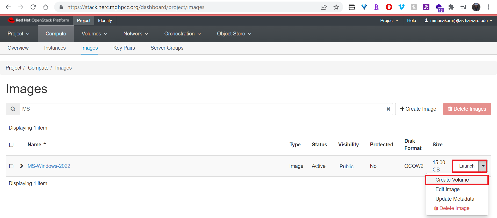
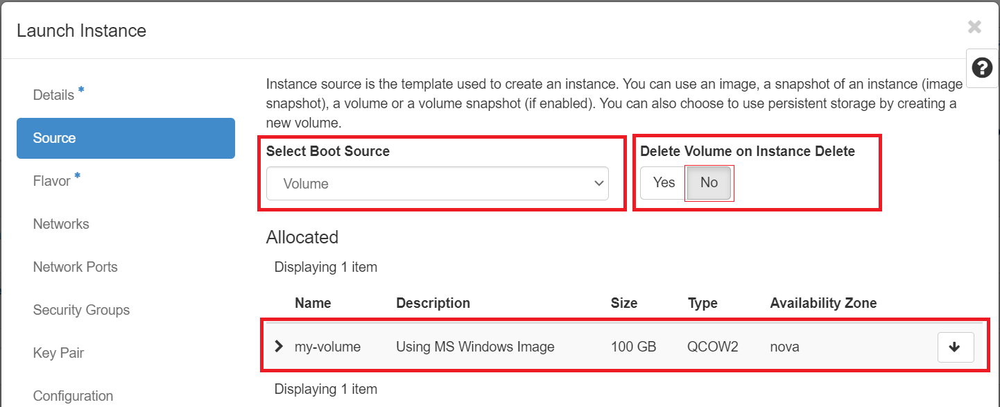
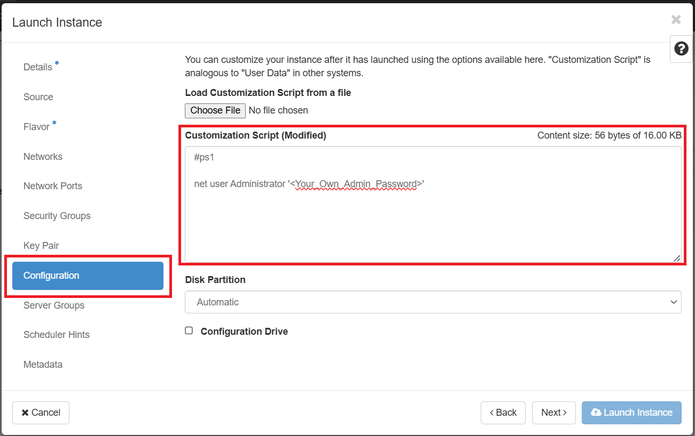

# Create a Windows virtual machine

## Launch an Instance using a boot volume

In this example, we will illustrate how to utilize a boot volume to launch a
Windows virtual machine, similar steps can be used on other types of virtual
machines. The following steps show how to create a virtual machine which boots
from an external volume:

-   Create a volume with source data from the image

-   Launch a VM with that volume as the system disk

!!! note "Recommendations"

    - The recommended method to create a Windows desktop virtual machine is `boot
    from volume`, although you can also launch a Windows-based instance following
    the normal process using `boot from image` as [described here](launch-a-VM.md).

    - To ensure smooth upgrade and maintenance of the system, select at least
    100 GiB for the size of the volume.

    - Make sure your project has sufficient [storage quotas](../../get-started/allocation/allocation-details.md#general-user-view).

### Create a volume from image

### 1. Using NERC's Horizon dashboard

Navigate: Project -> Compute -> Images.

Make sure you are able to see **MS-Windows-2022** is available on Images List for
your project as shown below:


Create a **Volume** using that _Windows Image_:



To ensure smooth upgrade and maintenance of the system, select at least 100 GiB
for the size of the volume as shown below:


### 2. Using the OpenStack CLI

**Prerequisites**:

To run the OpenStack CLI commands, you need to have:

-   OpenStack CLI setup, see
    [OpenStack Command Line setup](../openstack-cli/openstack-CLI.md#command-line-setup)
    for more information.

To create a volume from image using the CLI, do this:

#### Using the openstack client commands

Identify the image for the initial volume contents from `openstack image list`.

    openstack image list
    +--------------------------------------+---------------------+--------+
    | ID                                   | Name                | Status |
    +--------------------------------------+---------------------+--------+
    | a9b48e65-0cf9-413a-8215-81439cd63966 | MS-Windows-2022     | active |
    ...
    +--------------------------------------+---------------------+--------+

In the example above, this is image id `a9b48e65-0cf9-413a-8215-81439cd63966` for
`MS-Windows-2022`.

Creating a disk from this image with a size of **100 GiB** named "my-volume"
as follows.

    openstack volume create --image a9b48e65-0cf9-413a-8215-81439cd63966 --size 100 --description "Using MS Windows Image" my-volume
    +---------------------+--------------------------------------+
    | Field               | Value                                |
    +---------------------+--------------------------------------+
    | attachments         | []                                   |
    | availability_zone   | nova                                 |
    | bootable            | false                                |
    | consistencygroup_id | None                                 |
    | created_at          | 2024-02-03T23:38:50.000000           |
    | description         | Using MS Windows Image               |
    | encrypted           | False                                |
    | id                  | d8a5da4c-41c8-4c2d-b57a-8b6678ce4936 |
    | multiattach         | False                                |
    | name                | my-volume                            |
    | properties          |                                      |
    | replication_status  | None                                 |
    | size                | 100                                  |
    | snapshot_id         | None                                 |
    | source_volid        | None                                 |
    | status              | creating                             |
    | type                | tripleo                              |
    | updated_at          | None                                 |
    | user_id             | 938eb8bfc72e4cb3ad2b94e2eb4059f7     |
    +---------------------+--------------------------------------+

Checking the status again using `openstack volume show my-volume` will allow the
volume creation to be followed.

"downloading" means that the volume contents is being transferred from the image
service to the volume service

"available" means the volume can now be used for booting. A set of volume_image
meta data is also copied from the image service.

### Launch instance from existing bootable volume

### 1. Using Horizon dashboard

Navigate: Project -> Volumes -> Volumes.

Once successfully Volume is created, we can use the Volume to launch an instance
as shown below:


!!! warn "How do you make your VM setup and data persistent?"

    Only one instance at a time can be booted from a given volume. Make sure
    **"Delete Volume on Instance Delete"** is selected as **No** if you want the
    volume to persist even after the instance is terminated, which is the
    default setting, as shown below:

    

    **NOTE:** For more in-depth information on making your VM setup and data persistent,
    you can explore the details [here](../persistent-storage/volumes.md#how-do-you-make-your-vm-setup-and-data-persistent).

Add other information and setup a Security Group that allows RDP (port: 3389) as
shown below:


!!! danger "Very Important: Setting Administrator Credentials to Log into Your VM."

    To access this Windows VM, you must log in using Remote Desktop, as
    [described here](#how-to-add-remote-desktop-login-to-your-windows-instance).
    To configure a password for the "Administrator" user account, proceed to the
    "Configuration" section and enter the supplied PowerShell-based Customized Script.
    Make sure to substitute `<Your_Own_Admin_Password>` with your preferred password,
    which will enable Remote Desktop login to the Windows VM.

    ```sh
    #ps1

    net user Administrator '<Your_Own_Admin_Password>'
    ```

    Please ensure that your script in the "Configuration" section resembles the
    following syntax:

    

After some time the instance will be Active in Running state as shown below:


Attach a Floating IP to your instance:


### 2. Using the OpenStack CLI from the terminal

**Prerequisites**:

To run the OpenStack CLI commands, you need to have:

-   OpenStack CLI setup, see
    [OpenStack Command Line setup](../openstack-cli/openstack-CLI.md#command-line-setup)
    for more information.

To launch an instance from existing bootable volume using the CLI, do this:

#### Using the openstack client commands from terminal

Get the flavor name using `openstack flavor list`:

    openstack flavor list | grep cpu-su.4
    | b3f5dded-efe3-4630-a988-2959b73eba70 | cpu-su.4      |  16384 |   20 |         0 |     4 | True      |

To access this Windows VM, you must log in using Remote Desktop, as
[described here](#how-to-add-remote-desktop-login-to-your-windows-instance). Before
launching the VM using the OpenStack CLI, we'll prepare a PowerShell-based Customized
Script as "user-data".

!!! info "What is a user data file?"

    A user data file is a text file that you can include when running the
    `openstack server create` command. This file is used to customize your
    instance during boot.

You can place user data in a local file and pass it through the
`--user-data <user-data-file>` parameter at instance creation. You'll create a
local file named `admin_password.ps1` with the following content. Please remember
to replace `<Your_Own_Admin_Password>` with your chosen password, which will be
used to log in to the Windows VM via Remote Desktop.

    #ps1

    net user Administrator '<Your_Own_Admin_Password>'

Setup a Security Group named "rdp_test" that allows RDP (port: 3389) using the
CLI, use the command `openstack security group create <group-name>`:

    openstack security group create --description 'Allows RDP' rdp_test

    openstack security group rule create --protocol tcp --dst-port 3389 rdp_test

To create a Windows VM named "my-vm" using the specified parameters, including the
flavor name "cpu-su.4", existing key pair "my-key", security group "rdp_test",
user data from the file "admin_password.ps1" created above, and the volume with
name "my-volume" created above, you can run the following command:

    openstack server create --flavor cpu-su.4 \
        --key-name my-key \
        --security-group rdp_test \
        --user-data admin_password.ps1 \
        --volume my-volume \
        my-vm

To list all Floating IP addresses that are allocated to the current project, run:

    openstack floating ip list

    +--------------------------------------+---------------------+------------------+------+
    | ID                                   | Floating IP Address | Fixed IP Address | Port |
    +--------------------------------------+---------------------+------------------+------+
    | 760963b2-779c-4a49-a50d-f073c1ca5b9e | 199.94.60.220       | 192.168.0.195    | None |
    +--------------------------------------+---------------------+------------------+------+

!!! note "More About Floating IP"

    If the above command returns an empty list, meaning you don't have any
    available floating IPs, please refer to [this documentation](assign-a-floating-IP.md#allocate-a-floating-ip)
    on how to allocate a new Floating IP to your project.

Attach a Floating IP to your instance:

    openstack server add floating ip INSTANCE_NAME_OR_ID FLOATING_IP_ADDRESS

For example:

    openstack server add floating ip my-vm 199.94.60.220

### Accessing the graphical console in the Horizon dashboard

You can access the graphical console using the browser once the VM is in status
ACTIVE. It can take up to 15 minutes to reach this state.

The console is accessed by selecting the Instance Details for the machine and the
'Console' tab as shown below:


### How to add Remote Desktop login to your Windows instance

When the build and the Windows installation steps have completed, you can access
the console using the Windows Remote Desktop application. Remote Desktop login
should work with the Floating IP associated with the instance:


!!! warning "What is the user login for Windows Server 2022?"

    The default username is "Administrator," and the password is the one you set
    using the user data PowerShell script during the launch.


!!! info "Storage and Volume"

    - System disks are the first disk based on the flavor disk space and are
    generally used to store the operating system created from an image when the
    virtual machine is booted.

    - [Volumes](../persistent-storage/volumes.md) are
    persistent virtualized block devices independent of any particular instance.
    Volumes may be attached to a single instance at a time, but may be detached
    or reattached to a different instance while retaining all data, much like a
    USB drive. The size of the volume can be selected when it is created within
    the storage quota limits for the particular resource allocation.

### Connect additional disk using volume

To attach additional disk to a running Windows machine you can follow
[this documentation](../persistent-storage/volumes.md).
[**This guide**](../persistent-storage/format-and-mount-the-volume.md#for-windows-virtual-machine)
provides instructions on formatting and mounting a volume as an attached disk
within a Windows virtual machine.

---
