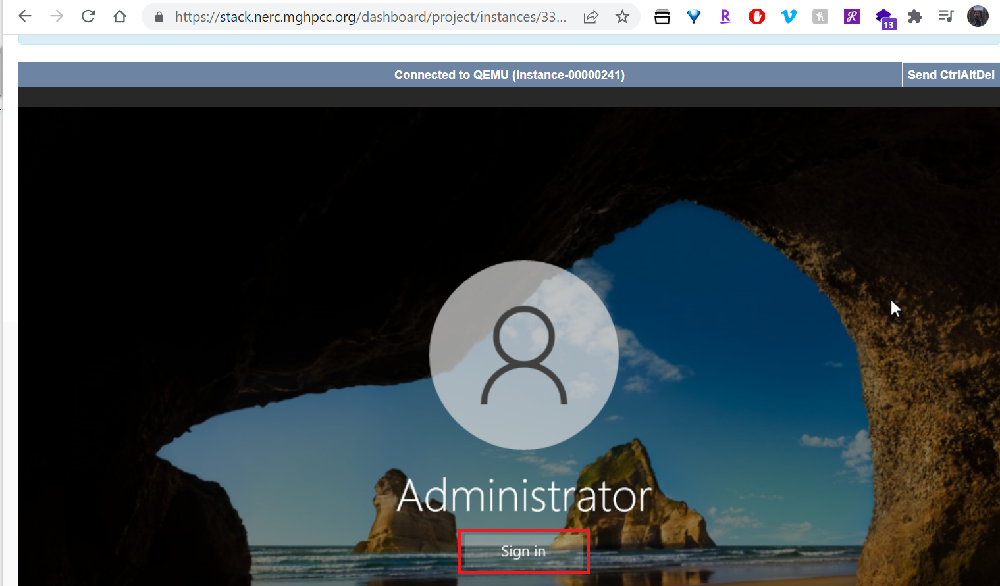
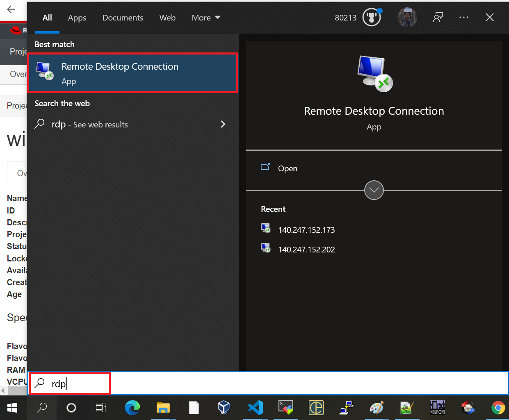
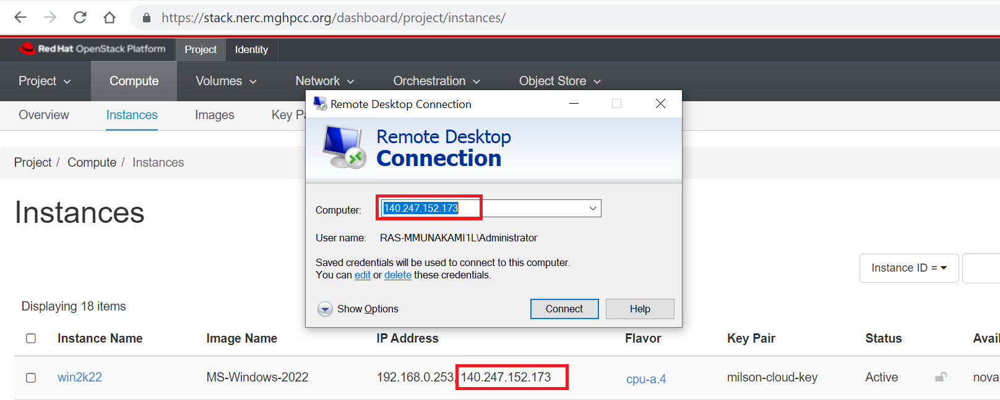

# Create a Windows virtual machine

## Launch an Instance using a boot volume

In this example, we will illustrate how to utilize a boot volume to launch a
Windows virtual machine, similar steps can be used to other types of virtual
machines. The following steps show how to create a virtual machine which boots
from an external volume:

- Create a volume with source data from the image

- Launch a VM with that volume as the system disk

!!! note "Recommendations"
    - The recommended method to create a Windows desktop virtual machine is boot
    from volume
    - To ensure smooth upgrade and maintenance of the system, select at least
    100GB for the size of the volume
    - Make sure your project has sufficient [storage quotas](../../get-started/get-an-allocation.md#general-user-view-of-openstack-resource-allocation).

### Create a volume from image

### 1. Using NERC's Horizon dashboard

Navigate: Project -> Compute -> Images.

Make sure you are able to see **MS-Windows-2022** is available on Images List for
your project as shown below:

Create a **Volume** using that *Windows Image*:

To ensure smooth upgrade and maintenance of the system, select at least 100GB
for the size of the volume as shown below:

### 2. Using the OpenStack CLI

**Prerequisites**:

To run the OpenStack CLI commands, you need to have:

- OpenStack CLI setup, see
[OpenStack Command Line setup](../openstack-cli/openstack-CLI.md#command-line-setup)
for more information.

To create a volume from image using the CLI, do this:

#### Using the openstack client commands

Identify the image for the initial volume contents from `openstack image list`.

    $ openstack image list
    +--------------------------------------+---------------------+--------+
    | ID                                   | Name                | Status |
    +--------------------------------------+---------------------+--------+
    | a9b48e65-0cf9-413a-8215-81439cd63966 | MS-Windows-2022     | active |
    | 41eafa05-c264-4840-8c17-746e6a388c2d | centos-7-x86_64     | active |
    | 14475f0f-3663-4ce7-a2dd-3cc206105bdf | centos-8-x86_64     | active |
    | 41fa5991-89d5-45ae-8268-b22224c772b2 | debian-10-x86_64    | active |
    | 99194159-fcd1-4281-b3e1-15956c275692 | fedora-36-x86_64    | active |
    | 74a33f77-fc42-4dd1-a5a2-55fb18fc50cc | rocky-8-x86_64      | active |
    | 75a40234-702b-4ab7-9d83-f436b05827c9 | ubuntu-18.04-x86_64 | active |
    | 8c87cf6f-32f9-4a4b-91a5-0d734b7c9770 | ubuntu-20.04-x86_64 | active |
    | da314c41-19bf-486a-b8da-39ca51fd17de | ubuntu-22.04-x86_64 | active |
    +--------------------------------------+---------------------+--------+

In the example below, this is image id `da314c41-19bf-486a-b8da-39ca51fd17de` for
`ubuntu-22.04-x86_64`.

Creating a disk from this image with a size of **80GB** is as follows.

    openstack volume create --image da314c41-19bf-486a-b8da-39ca51fd17de --size 80 --description "Using Ubuntu Image" my-volume
    +---------------------+--------------------------------------+
    | Field               | Value                                |
    +---------------------+--------------------------------------+
    | attachments         | []                                   |
    | availability_zone   | nova                                 |
    | bootable            | false                                |
    | consistencygroup_id | None                                 |
    | created_at          | 2024-02-03T23:38:50.000000           |
    | description         | Using Ubuntu Image                   |
    | encrypted           | False                                |
    | id                  | d8a5da4c-41c8-4c2d-b57a-8b6678ce4936 |
    | multiattach         | False                                |
    | name                | my-volume                            |
    | properties          |                                      |
    | replication_status  | None                                 |
    | size                | 80                                   |
    | snapshot_id         | None                                 |
    | source_volid        | None                                 |
    | status              | creating                             |
    | type                | tripleo                              |
    | updated_at          | None                                 |
    | user_id             | 938eb8bfc72e4cb3ad2b94e2eb4059f7     |
    +---------------------+--------------------------------------+

Checking the status again using `openstack volume show my-volume` will allow the
volume creation to be followed.

"downloading" means that the volume contents is being transferred from the image
service to the volume service

"available" means the volume can now be used for booting. A set of volume_image
meta data is also copied from the image service.

### Launch instance from existing bootable volume

### 1. Using Horizon dashboard

Navigate: Project -> Volumes -> Volumes.

Once successfully Volume is created, we can use the Volume to launch an instance
as shown below:

!!! note "Note"
    Only one instance at a time can be booted from a given volume. Make sure
    'Delete Volume on Instance Delete' is selected "No" if you want the volume
    to persist even after the instance is terminated.

Add other information and setup a Security Group that allows RDP as shown below:

### 2. Using the OpenStack CLI from the terminal

**Prerequisites**:

To run the OpenStack CLI commands, you need to have:

- OpenStack CLI setup, see
[OpenStack Command Line setup](../openstack-cli/openstack-CLI.md#command-line-setup)
for more information.

To launch an instance from existing bootable volume using the CLI, do this:

#### Using the openstack client commands from terminal

Get the flavor name using `openstack flavor list`:

    openstack flavor list | grep cpu-su.4
    | b3f5dded-efe3-4630-a988-2959b73eba70 | cpu-su.4      |  16384 |   20 |         0 |     4 | True      |

Create a VM named "my-vm" using the flavor name "cpu-su.4", key pair "my-key" and
volume created before with id "d8a5da4c-41c8-4c2d-b57a-8b6678ce4936" by running:

    openstack server create --flavor cpu-su.4 --key-name my-key --volume d8a5da4c-41c8-4c2d-b57a-8b6678ce4936 my-vm

### Accessing the graphical console in Horizon dashboard

You can access the graphical console using the browser once the VM is in status
ACTIVE. It can take up to 15 minutes to reach this state.

The console is accessed by selecting the Instance Details for the machine and the
'Console' tab as shown below:

!!! warning "What is the user login for Windows Server 2022?"
    To connect with this Windows VM you need to contact us by emailing us at
    [help@nerc.mghpcc.org](mailto:help@nerc.mghpcc.org?subject=NERC%20Windows%20Server%20Login%20Info)
    or, by submitting a new ticket at [the NERC's Support Ticketing System](https://mghpcc.supportsystem.com/open.php)

### How to have Remote Desktop login to your Windows instance

When the build and the Windows installation steps have completed, you can access
the console using the Windows Remote Desktop application. Remote Desktop login
should work with the Floating IP associated with the instance:

!!! warning "What is the user login for Windows Server 2022?"
    To connect with this Windows VM you need to contact us by emailing us at
    [help@nerc.mghpcc.org](mailto:help@nerc.mghpcc.org?subject=NERC%20Windows%20Server%20Login%20Info)
    or, by submitting a new ticket at [the NERC's Support Ticketing System](https://mghpcc.supportsystem.com/open.php)

!!! info "Storage and Volume"
    - System disks are the first disk based on the flavor disk space and are
    generally used to store the operating system created from an image when the
    virtual machine is booted.
    - [Volumes](../persistent-storage/volumes.md) are
    persistent virtualized block devices independent of any particular instance.
    Volumes may be attached to a single instance at a time, but may be detached
    or reattached to a different instance while retaining all data, much like a
    USB drive. The size of the volume can be selected when it is created within
    the storage quota limits for the particular resource allocation.

### Connect additional disk using volume

To attach additional disk to a running Windows machine you can follow
[this documentation](../persistent-storage/volumes.md).
[**This guide**](../persistent-storage/volumes.md#for-windows-virtual-machine)
provides instructions on formatting and mounting a volume as an attached disk
within a Windows virtual machine.

---
