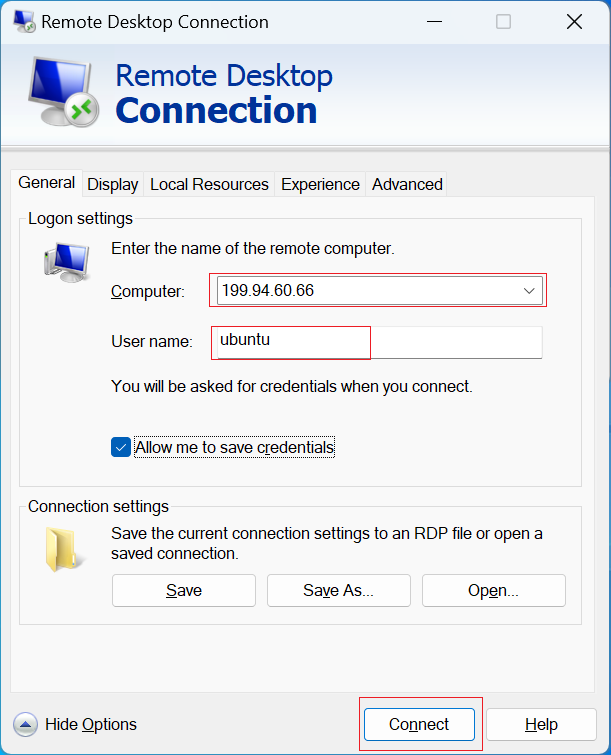
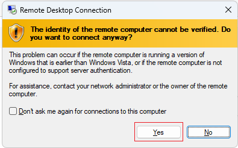
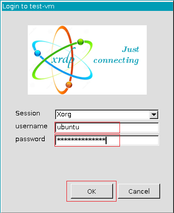
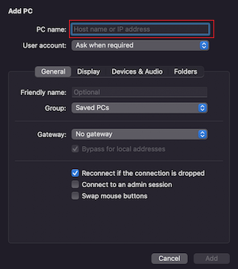
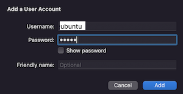

# SSH to the VM

**Shell**, or **SSH**, is used to administering and managing Linux workloads.
Before trying to access instances from the outside world, you need to make sure
you have followed these steps:

- You followed the instruction in [Create a Key Pair](../access-and-security/create-a-key-pair.md)
to set up a public ssh key.

- Your public ssh-key has selected (in "Key Pair" tab) while
[launching the instance](launch-a-VM.md).

- [Assign a Floating IP](assign-a-floating-IP.md) to the instance in order to
access it from outside world.

- Make sure you have added rules in the
[Security Groups](../access-and-security/security-groups.md#allowing-ssh) to
allow **ssh** using Port 22 access to the instance.

!!! info "How to update New Security Group(s) on any running VM?"
    If you want to attach/deattach any new Security Group(s) to/from a running VM
    after it has launched. First create all new Security Group(s) with all the rules
    required. Following [this guide](../access-and-security/security-groups.md#update-security-groups-to-a-running-vm),
    you'll be able to attach created security group(s) with all the
    required rules to a running VM.

Make a note of the Floating IP you have associated to your instance.


In our example, the IP is `199.94.60.66`.

Default usernames for all the base images are:

- **all Ubuntu images**: ubuntu
- **all CentOS images**: centos
- **all Rocky Linux images**: rocky
- **all Fedora images**: fedora
- **all Debian images**: debian
- **all RHEL images**: cloud-user

Our example VM was launched with the **ubuntu-22.04-x86_64** base image, the
user we need is 'ubuntu'.

Open a Terminal window and type:

    ssh ubuntu@199.94.60.66

Since you have never connected to this VM before, you will be asked if you are
sure you want to connect. Type `yes`.


!!! tip "Important Note"
    If you haven't added your key to ssh-agent, you may need to specify the
    private key file, like this: `ssh -i ~/.ssh/cloud.key ubuntu@199.94.60.66`

    To add your private key to the `ssh-agent` you can follow the following steps:

    1. `eval "$(ssh-agent -s)"`

        Output: `Agent pid 59566`

    2. `ssh-add ~/.ssh/cloud.key`

        If your private key is password protected, you'll be prompted to enter the
        passphrase.

    3. Verify that the key has been added by running `ssh-add -l`.

## SSH to the VM using SSH Config

**Alternatively,** You can also configure the setting for the remote instances in
your SSH configuration file (typically found in `~/.ssh/config`). The SSH configuration
file might include entry for your newly launched VM like this:

    Host ExampleHostLabel
        HostName 199.94.60.66
        User ubuntu
        IdentityFile ~/.ssh/cloud.key

Here, the `Host` value can be any label you want. The `HostName` value is the
**Floating IP** you have associated to your instance that you want to access, the
`User` value specifies the default account username based on your base OS image
used for the VM and `IdentityFile` specify the path to your **Private Key** on
your local machine. With this configuration defined, you can connect to the account
by simply using the Host value set as "ExampleHostLabel". You do not have to type
the username, hostname, and private key each time.

So, you can SSH into your host VM by running:

    ssh ExampleHostLabel

---

## Setting a password

When the VMs are launched, a strong, randomly-generated password is created for
the default user, and then discarded.

Once you connect to your VM, you will want to set a password in case you ever
need to log in via the console in the web dashboard.

For example, if your network connections aren't working correctly.

!!! info "Setting a password is necessary to use Remote Desktop Protocol (RDP)"
    [Remote Desktop Protocol](https://learn.microsoft.com/en-us/troubleshoot/windows-server/remote/understanding-remote-desktop-protocol)(RDP)
    is widely used for Windows remote connections, but you can also access
    and interact with the graphical user interface of a remote Linux server by
    using a tool like [xrdp](http://xrdp.org/), an open-source implementation of
    the RDP server. You can use `xrdp` to remotely access the Linux desktop. To
    do so, you need to utilize the RDP client. Moreover, xrdp delivers a login
    to the remote machines employing Microsoft RDP. This is why a user with
    the password is necessary to access the VM. You can refer to [this guide](#how-to-enable-remote-desktop-protocol-using-xrdp-on-ubuntu)
    on how to install and configure a RDP server using xrdp on a Ubuntu server
    and access it using a RDP client from your local machine.

Since you are not using it to log in over SSH or to sudo, it doesn't really
matter how hard it is to type, and we recommend using a randomly-generated
password.

Create a random password like this:

    ubuntu@test-vm:~$ cat /dev/urandom | base64 | dd count=14 bs=1
    T1W16HCyfZf8V514+0 records in
    14+0 records out
    14 bytes copied, 0.00110367 s, 12.7 kB/s

The 'count' parameter controls the number of characters.

The first [count] characters of the output are your randomly generated output,
followed immediately by "[count]+0",
so in the above example the password is: `T1W16HCyfZf8V5`.

Set the password for ubuntu using the command:

    ubuntu@test-vm:~$ sudo passwd ubuntu
    New password:
    Retype new password:
    ... password updated successfully

Store the password in a secure place. Don't send it over email, post it on your
wall on a sticky note, etc.

## Adding other people's SSH keys to the instance

You were able to log in using your own SSH key.

Right now Openstack only permits one key to be added at launch, so you need to
add your teammates keys manually.

Get your teammates' public keys. If they used ssh-keygen to create their key,
this will be in a file called <key_name>.pub on their machine.

If they created a key via the dashboard, or imported the key created with
ssh-keygen, their public key is viewable from the Key Pairs tab.

Click on the key pair name. The public key starts with 'ssh-rsa' and looks
something like this:

    ssh-rsa AAAAB3NzaC1yc2EAAAADAQABAAABAQDL6O5qNZHfgFwf4vnnib2XBub7ZU6khy6z6JQl3XRJg6I6gZ
    +Ss6tNjz0Xgax5My0bizORcka/TJ33S36XZfzUKGsZqyEl/ax1Xnl3MfE/rgq415wKljg4
    +QvDznF0OFqXjDIgL938N8G4mq/
    cKKtRSMdksAvNsAreO0W7GZi24G1giap4yuG4XghAXcYxDnOSzpyP2HgqgjsPdQue919IYvgH8shr
    +sPa48uC5sGU5PkTb0Pk/ef1Y5pLBQZYchyMakQvxjj7hHZaT/
    Lw0wIvGpPQay84plkjR2IDNb51tiEy5x163YDtrrP7RM2LJwXm+1vI8MzYmFRrXiqUyznd
    test_user@demo

Create a file called something like 'teammates.txt' and paste in your team's
public keys, one per line.

Hang onto this file to save yourself from having to do all the copy/pasting
every time you launch a new VM.

Copy the file to the vm:

    [you@your-laptop ~]$ scp teammates.txt ubuntu@199.94.60.66:~

If the copy works, you will see the output:

    teammates.txt                  100%    0     0KB/s   00:00

Append the file's contents to authorized_keys:

    [cloud-user@test-vm ~] #cat teammates.txt >> ~/.ssh/authorized_keys

Now your teammates should also be able to log in.

!!! warning "Important Note"
    Make sure to use `>>` instead of `>` to avoid overwriting your own key.

---

## Adding users to the instance

You may decide that each teammate should have their own user on the VM instead
of everyone logging in to the default user.

Once you log into the VM, you can create another user like this.

!!! tip "Note"
    The 'sudo_group' is different for different OS - in CentOS and Red Hat, the
    group is called 'wheel', while in Ubuntu, the group is called 'sudo'.

    ```
      sudo su
      # useradd -m <username>
      # passwd <username>
      # usermod -aG <sudo_group> <username>    <-- skip this step for users who
      # should not have root access
      # su username
      cd ~
      mkdir .ssh
      chmod 700 .ssh
      cd .ssh
      vi authorized_keys   <-- paste the public key for that user in this file
      chmod 600 authorized_keys
    ```

## How To Enable Remote Desktop Protocol Using xrdp on Ubuntu

### Log in to the server with Sudo access

In order to install the `xrdp`, you need to login to the server with `sudo` access
to it.

    ssh username@your_server_ip

For example:

    ssh ubuntu@199.94.60.66

### Installing a Desktop Environment

After connecting to your server using SSH update the list of available packages
using the following command:

    sudo apt update

Next, install the `xfce` and `xfce-goodies` packages on your server:

    sudo apt install xfce4 xfce4-goodies -y

!!! info "Select Display Manager"
    If prompted to choose a display manager, which manages graphical login mechanisms
    and user sessions, you can select any option from the list of available display
    managers. For instance, here we have `gdm3` as the default selection.

    

### Installing xrdp

To install xrdp, run the following command in the terminal:

    sudo apt install xrdp -y

After installing xrdp, verify the status of xrdp using systemctl:

    sudo systemctl status xrdp

This command will show the status as **active (running)**:

Output:

    ● xrdp.service - xrdp daemon
        Loaded: loaded (/lib/systemd/system/xrdp.service; enabled; vendor preset: enab>
        Active: active (running) since Mon 2024-02-12 21:33:01 UTC; 9s ago
        ...
        CGroup: /system.slice/xrdp.service
                └─8839 /usr/sbin/xrdp

!!! info "What if xrdp is not Running?"
    If the status of xrdp is not running, you may have to start the service manually
    with this command: `sudo systemctl start xrdp`. After executing the above command,
    verify the status again to ensure xrdp is in a running state.

Make xrdp use the desktop environment we previously created:

    sudo sed -i.bak '/fi/a #xrdp multiple users configuration \n xfce-session \n' /etc/xrdp/startwm.sh

### Configuring xrdp and Updating Security Groups

If you want to customize the default xrdp configuration (optional), you will need
to review the default configuration of xrdp, which is stored under `/etc/xrdp/xrdp.ini`.
`xrdp.ini` is the default configuration file to set up RDP connections to the
xrdp server. The configuration file can be modified and customized to meet the
RDP connection requirements.

Add a new security group with a RDP (port 3389) rule open to the public for a
RDP connection and attach that security group to your instance as [described here](../access-and-security/security-groups.md#allowing-rdp).

!!! info "How to Update Security Group(s) on a Running VM?"
    Following [this guide](../access-and-security/security-groups.md#update-security-groups-to-a-running-vm),
    you'll be able to attach created security group(s) with all the
    required rules to a running VM.

Restart the xrdp server to make sure all the above changes are reflected:

    sudo systemctl restart xrdp

### Testing the RDP Connection

You should now be able to connect to the Ubuntu VM via xrdp.

#### Testing the RDP Connection on Windows

If you are using Windows as a local desktop, Windows users have a RDP connection
application by default on their machines.

Enter your VM's Floating IP and username into the fillable text boxes for Computer
and User name.


You may need to press the down arrow for "Show Options" to input the username i.e.
`ubuntu`:



Press the Connect button. If you receive an alert that the "Remote Desktop can't
connect to the remote computer", check that you have properly attached the security
group with a RDP (port 3389) rule open to the public to your VM as [described here](../access-and-security/security-groups.md#allowing-rdp).

Press **Yes** if you receive the identity verification popup:



Then, enter your VM's username (ubuntu) and the password you created
for user ubuntu following [this steps](ssh-to-the-VM.md#setting-a-password.md).

Press **Ok**.



Once you have logged in, you should be able to access your Ubuntu Desktop environment:


#### Testing the RDP Connection on macOS

To test the connection using the Remote Desktop Connection client on macOS, first
launch the Microsoft Remote Desktop Connection app.

Press **Add PC**, then enter your remote server's Floating IP in the `PC name`
fillable box:



You can **Add a user account** when setting up the connection:



Once you have logged in, you can access your Ubuntu remote desktop. You can close
it with the exit button.

#### Testing the RDP Connection on Linux

If you are using Linux as your Local desktop you can connect to the server via
[Remmina](https://remmina.org/).

---
