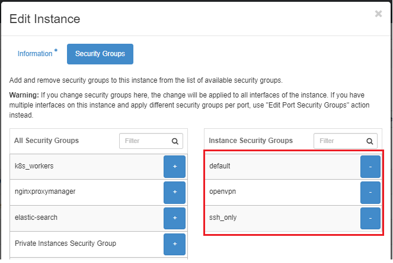
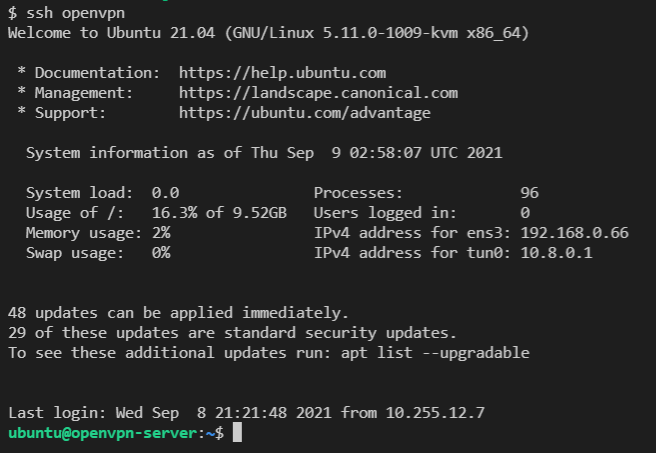
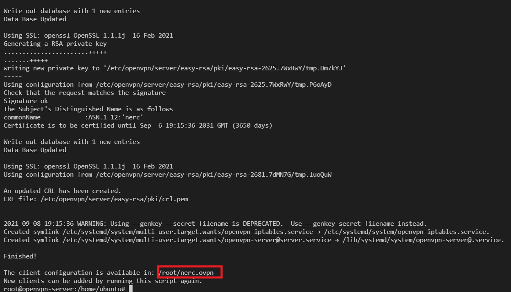
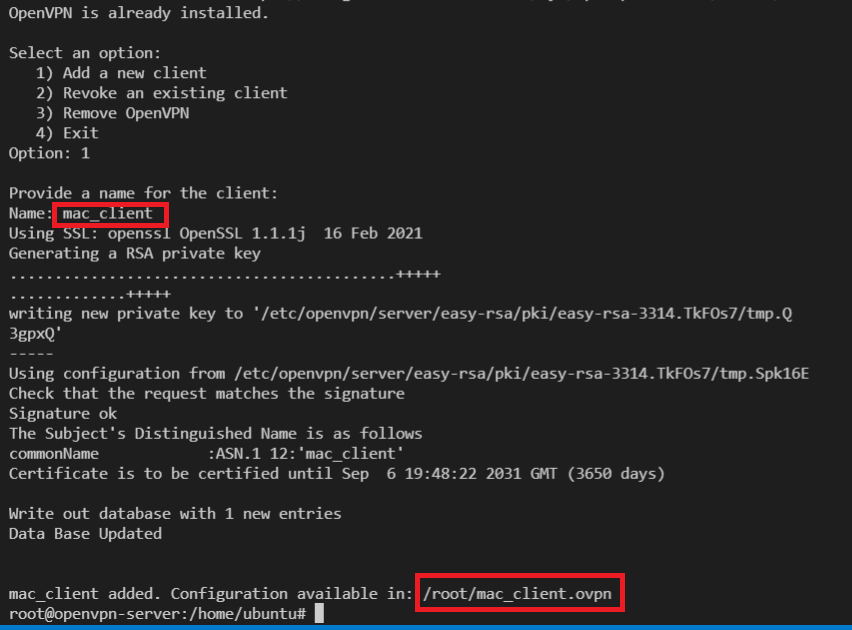

# OpenVPN

OpenVPN is a full-featured SSL VPN which implements OSI layer 2 or 3 secure
network extension using the industry standard SSL/TLS protocol, supports
flexible client authentication methods based on certificates, smart cards, and/
or username/password credentials, and allows user or group-specific access
control policies using firewall rules applied to the VPN virtual interface.

OpenVPN offers a scalable client/server mode, allowing multiple clients to
connect to a single OpenVPN server process over a single TCP or UDP port.

## Installing OpenVPN Server

You can read official documentation [here](https://openvpn.net/community-resources/how-to/#installing-openvpn).

You can spin up a new instance with "**ubuntu-22.04-x86_64**" or any available
Ubuntu OS image, named "**openvpn_server**" on OpenStack, with "**default**"
and "**ssh_only**" Security Groups attached to it.


Also, attach a Floating IP to this instance so you can ssh into it from outside.

Create a new Security Group i.e. "**openvpn**" that is listening on
**UDP port 1194** as shown below:


The Security Groups attached to the OpenVPN server should look similar to the image
below:

The Security Groups attached to the OpenVPN server includes "**default**",
"**ssh_only**" and "**openvpn**". It should look similar to the image shown below:



Finally, you'll want to configure the setting for the remote instances in your
SSH configuration file (typically found in `~/.ssh/config`). The SSH
configuration file might include entry for your newly created OpenVPN server
like this:

```sh
Host openvpn
  HostName 199.94.60.66
  User ubuntu
  IdentityFile ~/.ssh/cloud.key
```

1. Then you can ssh into the OpenVPN Server running: `ssh openvpn`

    

2. Also note that OpenVPN must be installed and run by a user who has
**administrative/root** privileges. So, we need to run the command: `sudo su`

3. We are using [this repo](https://github.com/Nyr/openvpn-install) to install
OpenVPN server on this ubuntu server.

    For that, run the script and follow the assistant:

      `wget https://git.io/vpn -O openvpn-install.sh && bash openvpn-install.sh`

      

      You can press **Enter** for all default values. And, while entering a name
      for the first client you can give "**nerc**" as the client name, this will
      generate a new configuration file (.ovpn file) named as "**nerc.ovpn**".
      Based on your client's name it will name the config file as
      "**<your_client_name>.ovpn**"

      

4. Copy the generated config file from "**/root/nerc.ovpn**" to "**/home/ubuntu/
nerc.ovpn**" by running: `cp /root/nerc.ovpn .`

5. Update the ownership of the config file to ubuntu user and ubuntu group by
running the following command: `chown ubuntu:ubuntu nerc.ovpn`

6. You can exit from the root and ssh session all together and then copy the
configuration file to your local machine by running the following script on
your local machine's terminal: `scp openvpn:nerc.ovpn .`

## To add a new client user

Once it ends, you can run it again to add more users, remove some of them or
even completely uninstall OpenVPN.

For this, run the script and follow the assistant:

`wget https://git.io/vpn -O openvpn-install.sh && bash openvpn-install.sh`



Here, you are giving client name as "**mac_client**" and that will generate a
new configuration file at "**/root/mac_client.ovpn**". You can repeat above
steps: **4 to 6** to copy this new client's configuration file and share it to
the new client.

---

!!! note "Important Note"
    You need to contact your project administrator to get your own OpenVPN
    configuration file (file with .ovpn extension). Download it and Keep it in
    your local machine so in next steps we can use this configuration client
    profile file.

A OpenVPN client or compatible software is needed to connect to the OpenVPN
server. Please install one of these clients depending on your device. The
client program must be configured with a client profile to connect to the
OpenVPN server.

### Windows

OpenVPN source code and Windows installers can be [downloaded here](https://
openvpn.net/community-downloads/). The OpenVPN executable should be installed
on both server and client machines since the single executable provides both
client and server functions. Please see the [OpenVPN client setup guide for
Windows](openvpn_gui_for_windows.md).

### Mac OS X

The client we recommend and support for Mac OS is **Tunnelblick**. To install
Tunnelblick, download the dmg installer file from the [Tunnelblick site](https:/
/tunnelblick.net/index.html), mount the dmg, and drag the Tunnelblick
application to Applications. Please refer to
[this guide](tunnelblick_for_macos.md) for more information.

### Linux

OpenVPN is available through the package management system on most Linux distributions.

**On Debian/Ubuntu:**

```sh
sudo apt-get install openvpn
```

**On RedHat/Rocky/AlmaLinux:**

```sh
sudo dnf install openvpn
```

Then, to run OpenVPN using the client profile:

**Move** the VPN client profile (configuration) file to **/etc/openvpn/** :

```sh
sudo mv nerc.ovpn /etc/openvpn/client.conf
```

Restart the OpenVPN daemon (i.e., This will start OpenVPN connection and will
automatically run on boot):

```sh
sudo /etc/init.d/openvpn start
```

**OR,**

```sh
sudo systemctl enable --now openvpn@client
sudo systemctl start openvpn@client
```

Checking the status:

```sh
systemctl status openvpn@client
```

**Alternatively,** if you want to run OpenVPN manually each time, then run:

```sh
sudo openvpn --config /etc/openvpn/client.ovpn
```

**OR,**

```sh
sudo openvpn --config nerc.ovpn
```

---
