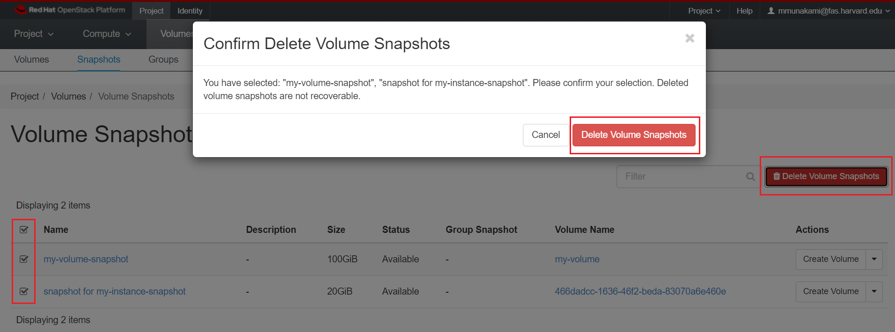
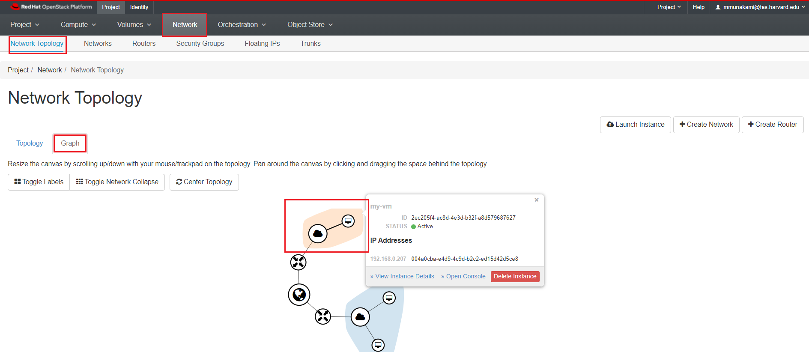

# Decommission a VM

Make sure you backup your critical data or configuration from the virtual machines.
You can follow [this guide](../data-transfer/data-transfer-from-to-vm.md) to
initiate and perform data transfer from/to the VM.

## VM deletion

VMs can be deleted using either the OpenStack dashboard or via the openstack client
`openstack server delete` command.

!!! danger "Important Note"
    This will immediately terminate the instance, delete all content of the
    virtual machine and erase the disk. This operation is not recoverable.

There are other options available if you wish to keep the virtual machine for
future usage. These do, however, continue to use quota for the project even though
the VM is not running.

- **Suspend the VM** which saves the state of the VM to disk so it could be restarted
later

- **Snapshot the VM** to keep an offline copy of the virtual machine

If however, the virtual machine is no longer required and no data on the
associated system or ephemeral disk needs to be preserved, the following command
can be run:

    openstack server delete <INSTANCE_NAME_OR_ID>

The quota associated with this virtual machine will be returned to the project
and you can review and verify that looking at your
[OpenStack dashboard overview](../logging-in/dashboard-overview.md#compute-panel).

Navigate to Project -> Compute -> Overview.

If the quota does not return, please raise a ticket.

## Delete volumes and snapshots

For instructions on deleting volume(s), please refer to [this documentation](../persistent-storage/delete-volumes.md).

To delete snapshot(s), if that snapshot is not used for any running instance.

Navigate to Project -> Volumes -> Snapshots.

!!! warn "Unable to Delete Snapshots"
    First delete all volumes and instances (and its attached volumes) that are
    created using the snapshot first, you will not be able to delete the volume
    snapshots.

## Delete all custom built Images and Instance Snapshot built Images

Navigate to Project -> Compute -> Images.

Select all of the custom built that have Visibility set as "Private" images to delete.

## Delete your all private Networks, Routers and Internal Interfaces on the Routers

To review all Network and its connectivities, you need to:

Navigate to Project -> Network -> Network Topology.

This will shows all view of current Network in your project in Graph or Topology
view. Make sure non instances are connected to your private network. If there are
any instances then [follow this](#vm-deletion) to delete those VMs.

First, delete all other Routers used to create private networks except `default_router`
from:

Navigate to Project -> Network -> Routers.

First, delete all other Routers used to create private networks except `default_network`
and `provider` then only you will be able to delete the Networks from:

Navigate to Project -> Network -> Networks.

!!! warn "Unable to Delete Networks"
    First delete all instances and then delete all routers then only you will be
    able to delete the associated private networks.

## Release all Floating IPs

Navigate to Project -> Network -> Floating IPs.

## Clean up all Security Groups except `default`

## Delete all of your stored Key Pairs

## Review your OpenStack Dashboard

## ColdFront to reduce the Storage Quota to Zero

---
