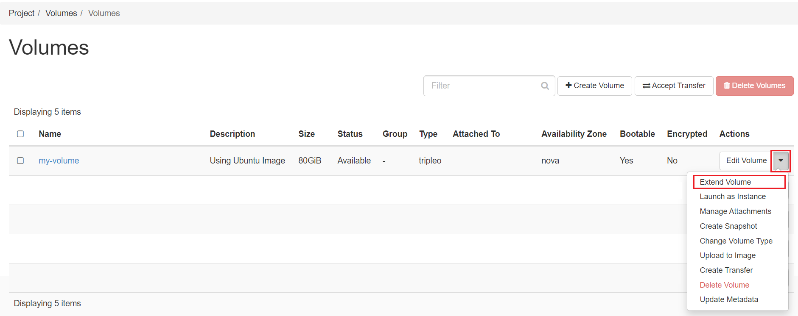
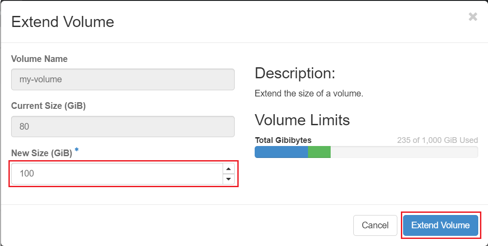

# Extending Volume

A volume can be made larger while maintaining the existing contents, assuming the
file system supports resizing. We can extend a volume that is not attached to any
VM and in **"Available"** status.

The steps are as follows:

-   Extend the volume to its new size

-   Extend the filesystem to its new size

## Using Horizon dashboard

Once you're logged in to NERC's Horizon dashboard.

Navigate to _Project -> Volumes -> Volumes_.



Specify, the new extened size in GiB:



## Using the CLI

**Prerequisites**:

To run the OpenStack CLI commands, you need to have:

-   OpenStack CLI setup, see [OpenStack Command Line setup](../openstack-cli/openstack-CLI.md#command-line-setup)
    for more information.

### Using the openstack client

The following openstack client command syntax can be used to extend any existing
volume from its previous size to a new size of <NEW_SIZE_IN_GiB>:

```sh
openstack volume set --size <NEW_SIZE_IN_GiB> <VOLUME_NAME_OR_ID>
```

For example:

```sh
openstack volume set --size 100 my-volume
```

where "my-volume" is the existing volume with a size of **80 GiB** and is going
to be extended to a new size of **100 GiB**."

!!! tip "Pro Tip"

    If your volume name `<VOLUME_NAME_OR_ID>` includes spaces, you need to enclose
    them in quotes, i.e. `"<VOLUME_NAME_OR_ID>"`.

    For example: `openstack volume set --size 100 "My Volume"`.

For windows systems, please follow the [provider documentation](https://docs.microsoft.com/en-us/windows-server/storage/disk-management/extend-a-basic-volume).

!!! info "Please note"

    - Volumes can be made larger, but not smaller. There is no support for
    shrinking existing volumes.

    - The procedure given above has been tested with ext4 and XFS filesystems only.

---
