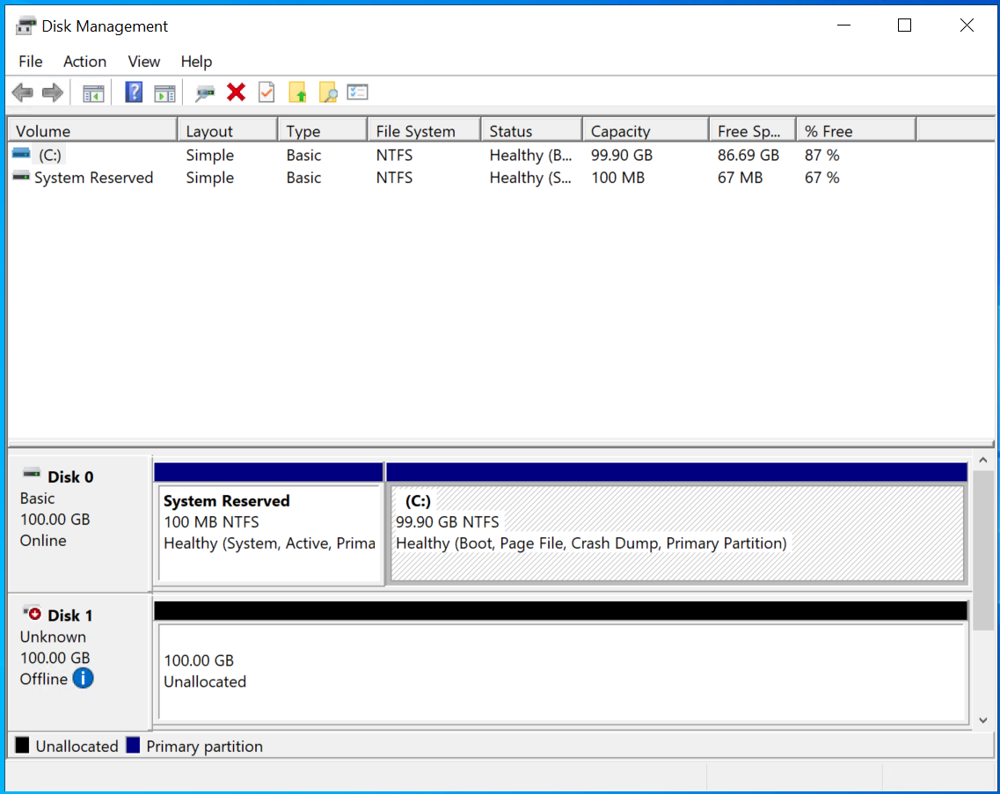
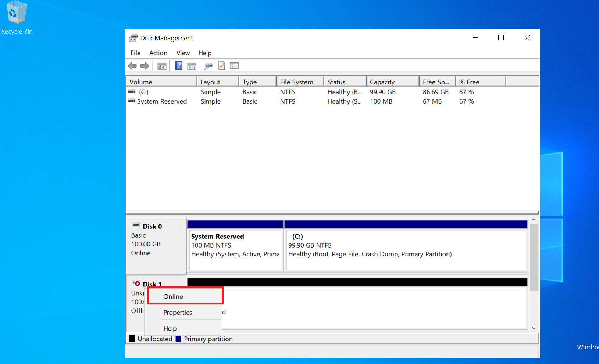
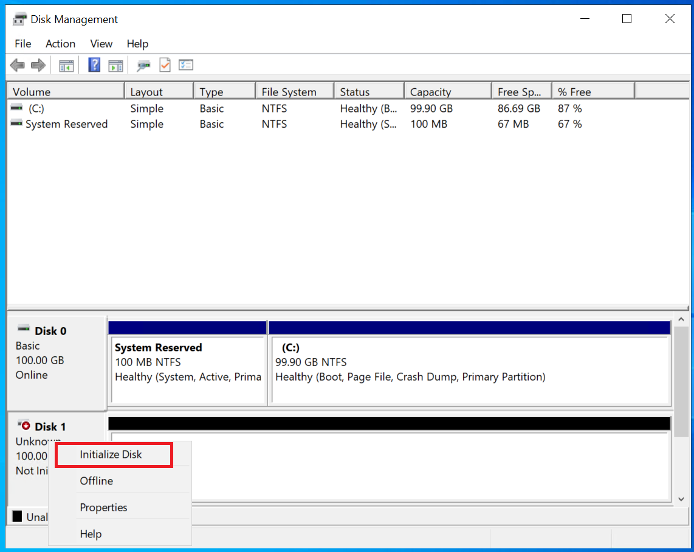

# Format And Mount The Volume

**Prerequisites**:

Before formatting and mounting the volume, you need to have already created a
new volume as [referred here](create-an-empty-volume.md) and attached it to any
running VM, as [described here](attach-the-volume-to-an-instance.md).

## For Linux based virtual machine

To verify that the newly created volume, "my-volume", exists and is attached to
a VM, "test-vm", run this openstack client command:

    openstack volume list
    +--------------------------------------+-----------------+--------+------+----------------------------------+
    | ID                                   | Name            | Status | Size | Attached to                      |
    +--------------------------------------+-----------------+--------+------+----------------------------------+
    | 563048c5-d27b-4397-bb4e-034e0f4d9fa7 |                 | in-use |   20 | Attached to test-vm on /dev/vda  |
    | 5b5380bd-a15b-408b-8352-9d4219cf30f3 | my-volume       | in-use |   20 | Attached to test-vm on /dev/vdb  |
    +--------------------------------------+-----------------+--------+------+----------------------------------+

The volume has a status of "in-use" and "Attached To" column shows which instance
it is attached to, and what device name it has.

This will be something like `/dev/vdb` but it can vary depending on the state
of your instance, and whether you have attached volumes before.

Make note of the device name of your volume.

SSH into your instance. You should now see the volume as an additional disk in
the output of `sudo fdisk -l` or `lsblk` or `cat /proc/partitions`.

    # lsblk
    NAME    MAJ:MIN RM  SIZE RO TYPE MOUNTPOINT
    ...
    vda     254:0    0   10G  0 disk
    ├─vda1  254:1    0  9.9G  0 part /
    ├─vda14 254:14   0    4M  0 part
    └─vda15 254:15   0  106M  0 part /boot/efi
    vdb     254:16   0    1G  0 disk

Here, we see the volume as the disk `vdb`, which matches the `/dev/vdb/` we previously
noted in the "Attached To" column.

Create a filesystem on the volume and mount it. In this example, we will create
an `ext4` filesystem:

Run the following commands as `root` user:

    mkfs.ext4 /dev/vdb
    mkdir /mnt/test_volume
    mount /dev/vdb /mnt/test_volume
    df -H

The volume is now available at the mount point:

    lsblk
    NAME    MAJ:MIN RM  SIZE RO TYPE MOUNTPOINT
    ...
    vda     254:0    0   10G  0 disk
    ├─vda1  254:1    0  9.9G  0 part /
    ├─vda14 254:14   0    4M  0 part
    └─vda15 254:15   0  106M  0 part /boot/efi
    vdb     254:16   0    1G  0 disk /mnt/test_volume

If you place data in the directory `/mnt/test_volume`, detach the volume, and
mount it to another instance, the second instance will have access to the data.

!!! note "Important Note"
    In this case it's easy to spot because there is only one additional disk attached
    to the instance, but it's important to keep track of the device name, especially
    if you have multiple volumes attached.

## For Windows virtual machine

Here, we create an empty volume following the steps outlined in [this documentation](create-an-empty-volume.md).

Please make sure you are creating volume of the size 100 GiB:

Then attach the newly created volume to a running Windows VM:

Login remote desktop using the Floating IP attached to the Windows VM:

!!! warning "What is the user login for Windows Server 2022?"
    The default username is "Administrator," and the password is the one you set
    using the user data PowerShell script during the launch as
    [described here](../../openstack/create-and-connect-to-the-VM/create-a-Windows-VM.md#launch-instance-from-existing-bootable-volume).

Once connected search for "Disk Management" from Windows search box. This will
show all attached disk as **Unknown** and **Offline** as shown here:

In Disk Management, select and hold (or right-click) the disk you want to
initialize, and then select "Initialize Disk". If the disk is listed as **Offline**,
first select and hold (or right-click) the disk, and then select "Online".

In the Initialize Disk dialog box, make sure the correct disk is selected, and
then choose OK to accept the default partition style. If you need to change the
partition style (GPT or MBR), see [Compare partition styles - GPT and MBR](https://learn.microsoft.com/en-us/windows-server/storage/disk-management/initialize-new-disks#compare-partition-styles---gpt-and-mbr).

Format the New Volume:

- Select and hold (or right-click) the unallocated space of the new disk.
- Select "New Simple Volume" and follow the wizard to create a new partition.

- Choose the file system (usually NTFS for Windows).
- Assign a drive letter or mount point.

Complete Formatting:

- Complete the wizard to format the new volume.

- Once formatting is complete, the new volume should be visible in File Explorer
  as shown below:

---
