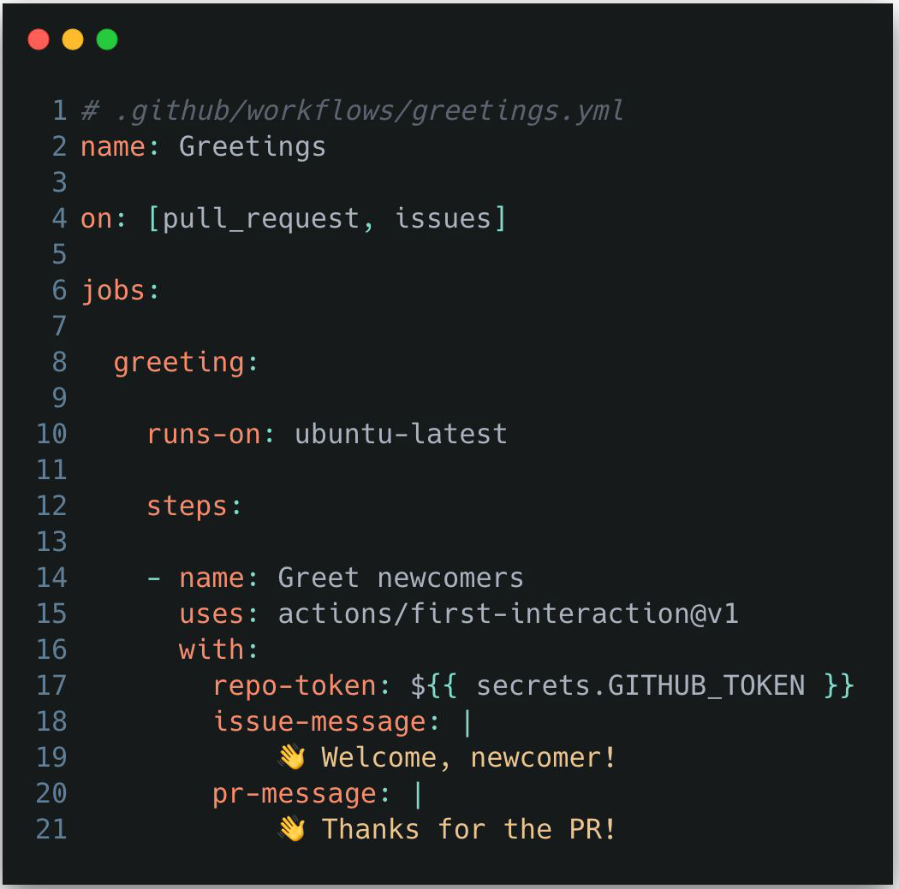
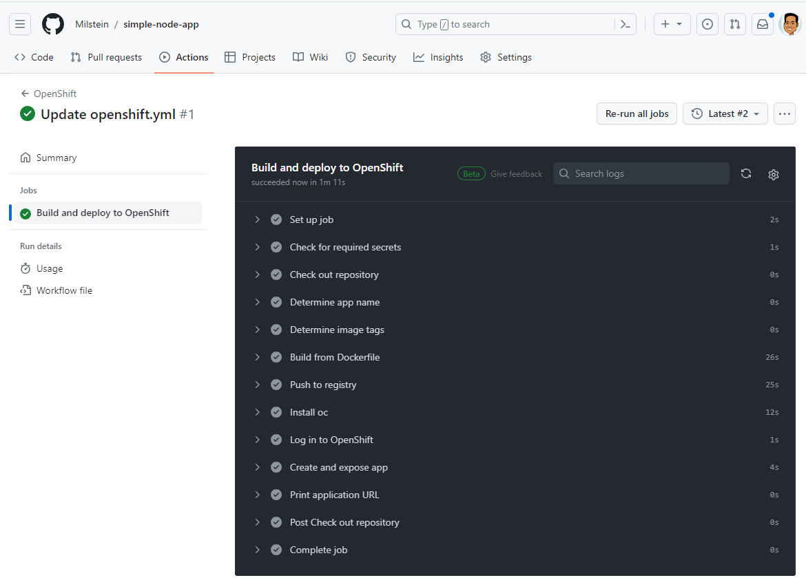

# How to setup GitHub Actions Pipeline

[GitHub Actions](https://github.com/features/actions) gives you the ability to
create workflows to automate the deployment process to OpenShift. GitHub Actions
makes it easy to automate all your CI/CD workflows.

## Terminiology

### Workflow

Automation-as-code that you can set up in your repository.

### Events

30+ workflow triggers, including on schedule and from external systems.

### Actions

Community-powered units of work that you can use as steps to create a job in a
workflow.

## Deploy an Application to your NERC OpenShift Project

- **Prerequisites**

    You must have at least one active **NERC-OCP (OpenShift)** type resource allocation.
    You can refer to [this documentation](../../../get-started/allocation/requesting-an-allocation.md#request-a-new-openshift-resource-allocation-for-an-openshift-project)
    on how to get allocation and request "NERC-OCP (OpenShift)" type resource allocations.

### Steps

1.  Access to the NERC's OpenShift Container Platform at [https://console.apps.shift.nerc.mghpcc.org](https://console.apps.shift.nerc.mghpcc.org)
    as [described here](../../../openshift/logging-in/access-the-openshift-web-console.md).
    To get access to NERC's OCP web console you need to be part of ColdFront's active
    allocation.

2.  Setup the OpenShift CLI Tools locally and configure the OpenShift CLI to
    enable `oc` commands. Refer to [this user guide](../../../openshift/logging-in/setup-the-openshift-cli.md).

3.  Setup Github CLI on your local machine as [described here](https://docs.github.com/en/github-cli/github-cli/quickstart)
    and verify you are able to run `gh` commands as shown below:

    

4.  Fork the `simple-node-app` App in your own Github:

    This application runs a simple node.js server and serves up some static routes
    with some static responses. This demo shows a simple container based app can
    easily be bootstrapped onto your NERC OpenShift project space.

    !!! warning "Very Important Information"

        As you won't have full access to [this repository](https://github.com/nerc-project/simple-node-app/),
        we recommend first forking the repository on your own GitHub account. So,
        you'll need to update all references to `https://github.com/nerc-project/simple-node-app.git`
        to point to your own forked repository.

    To create a fork of the example `simple-node-app` repository:

    1. Go to [https://github.com/nerc-project/simple-node-app](https://github.com/nerc-project/simple-node-app).

    2. Cick the "Fork" button to create a fork in your own GitHub account, e.g. "`https://github.com/<github_username>/simple-node-app`".

5.  Clone the _simple-node-app_ git repository:

    git clone <https://github.com/><github_username>/simple-node-app.git
    cd simple-node-app

6.  Run either `setsecret.cmd` file if you are using **Windows** or `setsecret.sh`
    file if you are using **Linux** based machine. Once executed, verify Github Secrets
    are set Properly under your github repo's
    _settings >> secrets and variables >> Actions_ as shown here:

    

7.  Enable and Update GitHub Actions Pipeline on your own forked repo:

    - Enable the OpenShift Workflow in the Actions tab of in your GitHub repository.

    - Update the provided sample OpenShift workflow YAML file i.e. `openshift.yml`,
      which is located at "`https://github.com/<github_username>/simple-node-app/actions/workflows/openshift.yml`".

        !!! info "Very Important Information"

            Workflow execution on OpenShift pipelines follows these steps:

            1. Checkout your repository
            2. Perform a container image build
            3. Push the built image to the GitHub Container Registry (GHCR) or
            your preferred Registry
            4. Log in to your NERC OpenShift cluster's project space
            5. Create an OpenShift app from the image and expose it to the internet

8.  Edit the top-level 'env' section as marked with '🖊️' if the defaults are not
    suitable for your project.

9.  (Optional) Edit the build-image step to build your project:

    The default build type uses a Dockerfile at the root of the repository,
    but can be replaced with a different file, a source-to-image build, or a step-by-step
    [buildah](https://buildah.io/) build.

10. Commit and push the workflow file to your default branch to trigger a workflow
    run as shown below:

    

11. Verify that you can see the newly deployed application on the NERC's OpenShift
    Container Platform at [https://console.apps.shift.nerc.mghpcc.org](https://console.apps.shift.nerc.mghpcc.org)
    as [described here](../../../openshift/logging-in/access-the-openshift-web-console.md),
    and ensure that it can be browsed properly.

    

That's it! Every time you commit changes to your GitHub repo, GitHub Actions
will trigger your configured Pipeline, which will ultimately deploy your
application to your own NERC OpenShift Project.

---
