# How to Set Up Jenkins Pipeline on a VM

This document will walk you through how to setup a minimal **"CI/CD Pipeline To Deploy
To Kubernetes Cluster Using a CI/CD tool called Jenkins"** on your NERC's OpenStack
environment. Jenkins uses the Kubernetes control plane on K8s Cluster to run pipeline
tasks that enable DevOps to spend more time coding and testing and less time
troubleshooting.

!!! note "Prerequisite"
    You need Kubernetes cluster running in your OpenStack environment. To setup your
    K8s cluster please [Read this](../../kubernetes/kubeadm/single-master-clusters-with-kubeadm.md).


*Figure: CI/CD Pipeline To Deploy To Kubernetes Cluster Using Jenkins on NERC*

## Setup a Jenkins Server VM

- Launch 1 Linux machine based on `ubuntu-20.04-x86_64` and `cpu-su.2` flavor with
2vCPU, 8GB RAM, and 20GB storage.

- Make sure you have added rules in the
[Security Groups](../../../openstack/access-and-security/security-groups.md#allowing-ssh)
to allow **ssh** using Port 22 access to the instance.

- Setup a new Security Group with the following rules exposing **port 8080** and
attach it to your new instance.

    

- [Assign a Floating IP](../../../openstack/create-and-connect-to-the-VM/assign-a-floating-IP.md)
to your new instance so that you will be able to ssh into this machine:

    ```sh
    ssh ubuntu@<Floating-IP> -A -i <Path_To_Your_Private_Key>
    ```

    For example:

    ```sh
    ssh ubuntu@199.94.60.4 -A -i cloud.key
    ```

Upon successfully SSH accessing the machine, execute the following dependencies:

!!! info "Very Important"
    Run the following steps as non-root user i.e. **ubuntu**.

- Update the repositories and packages:

    ```sh
    sudo apt-get update && sudo apt-get upgrade -y
    ```

- Turn off `swap`

    ```sh
    swapoff -a
    sudo sed -i '/ swap / s/^/#/' /etc/fstab
    ```

- Install `curl` and `apt-transport-https`

    ```sh
    sudo apt-get update && sudo apt-get install -y apt-transport-https curl
    ```

---

## Download and install the latest version of **Docker CE**

- Download and install Docker CE:

    ```sh
    curl -fsSL https://get.docker.com -o get-docker.sh
    sudo sh get-docker.sh
    ```

- Configure the Docker daemon:

    ```sh
    sudo usermod -aG docker $USER && newgrp docker
    ```

---

## Install **kubectl**

• **kubectl**: the command line util to talk to your cluster.

- Download the Google Cloud public signing key and add key to verify releases

    ```sh
    curl -s https://packages.cloud.google.com/apt/doc/apt-key.gpg | sudo apt-key add -
    ```

- add kubernetes apt repo

    ```sh
    cat <<EOF | sudo tee /etc/apt/sources.list.d/kubernetes.list
    deb https://apt.kubernetes.io/ kubernetes-xenial main
    EOF
    ```

- Install kubectl

    ```sh
    sudo apt-get update
    sudo apt-get install -y kubectl
    ```

- `apt-mark hold` is used so that these packages will not be updated/removed automatically

    ```sh
    sudo apt-mark hold kubectl
    ```

---

## Install a Jenkins Server using Docker

To install a Jenkins server using Docker run the following command:

```ssh
docker run -u 0 --privileged --name jenkins -it -d -p 8080:8080 -p 50000:50000 \
    -v /var/run/docker.sock:/var/run/docker.sock \
    -v $(which docker):/usr/bin/docker \
    -v $(which kubectl):/usr/bin/kubectl \
    -v /home/jenkins_home:/var/jenkins_home \
    jenkins/jenkins:latest
```

Once successfully docker run, browse to `http://<Floating-IP>:8080`
this will show you where to get the initial Administrator password to get started
i.e. `/var/jenkins_home/secrets/initialAdminPassword` as shown below:

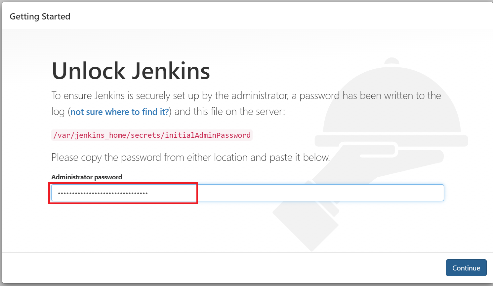

The `/var/jenkins_home` in Jenkins docker container is a mounted volume to the
host's `/home/jenkins_home` so you can just browse to
`/home/jenkins_home/secrets/initialAdminPassword` on your ssh'ed host machine to
copy the same content from `/var/jenkins_home/secrets/initialAdminPassword`.

!!! note "Initial Admin Password"
    If you can't find the Admin password at `/var/jenkins_home/secrets/initialAdminPassword`,
    then try to locate it at its original location, i.e. `/home/jenkins_home/secrets/initialAdminPassword`.

**OR**, you can run `docker ps` on worker node where you run the Jenkins server.
Note the **Name** of the docker container and then run: `docker logs -f <jenkins_docker_container_name>`.
This will show the initial Administrator password on the terminal which you can
copy and paste on the web GUI on the browser.

!!! note "Initial Admin Password"
    When you run `docker logs -f <jenkins_docker_container_name>`, the initial
    password for the "Admin" user can be found between the rows of asterisks
    as shown below:
    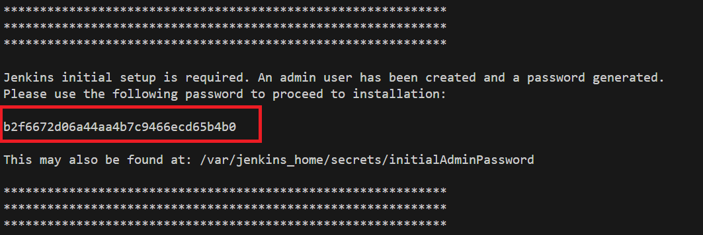

- Once you login to the Jenkins Web UI by entering the admin password shown on CLI
terminal, click on the "Install suggested plugins" button as shown below:

    

    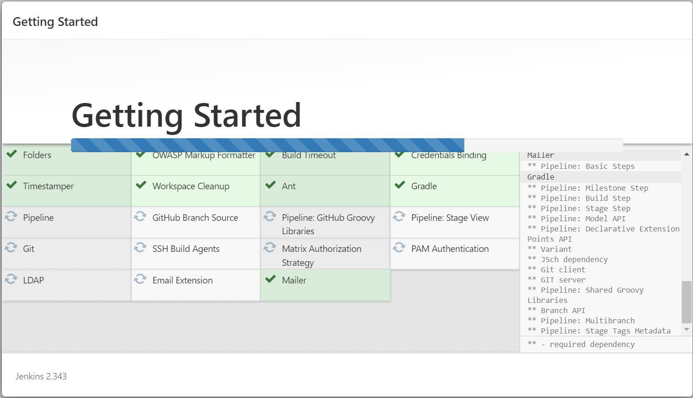

    Continue by selecting 'Skip and continue as admin' first as shown below:

    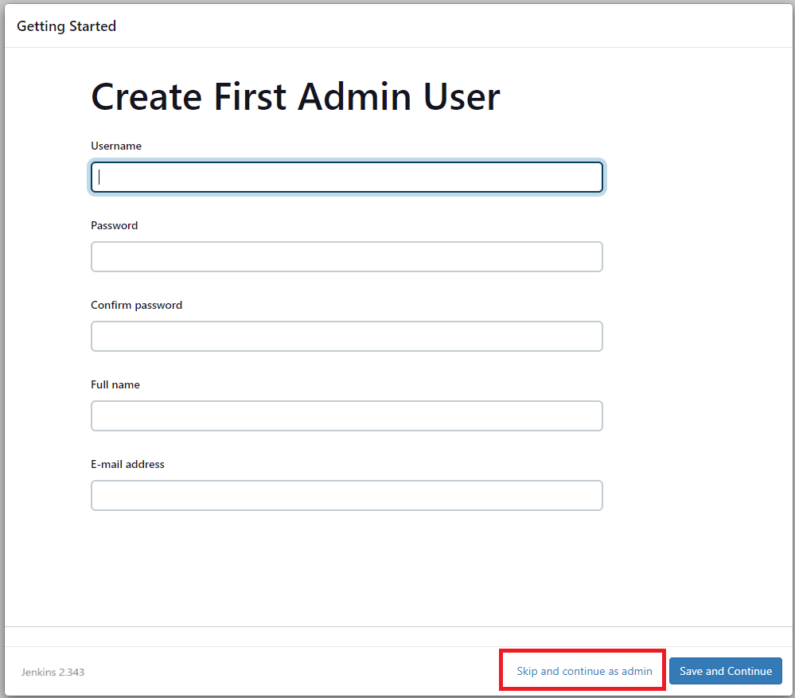

    Then click the 'Save and Finish' button as shown below and then, Jenkins is ready
    to use.

    

## Install the required Plugins

- Jenkins has a wide range of plugin options. From your Jenkins dashboard navigate
to "Manage Jenkins > Manage Plugins" as shown below:

    

    Select the "Available" tab and then locate **Docker pipeline** by searching
    and then click "Install without restart" button as shown below:

    

    Also, install the **Kubernetes CLI** plugin that allows you to configure `kubectl`
    commands on Jenkinsfile to interact with Kubernetes clusters as shown below:

    

## Create the required Credentials

- Create a global credential for your Docker Hub Registry by providing the username
and password that will be used by the Jenkins pipelines:

    1. Click on the "Manage Jenkins" menu and then click on the "Manage Credentials"
      link as shown below:

        

    2. Click on Jenkins Store as shown below:

        

    3. The credentials can be added by clicking the 'Add Credentials' button in
    the left pane.

        

- First, add the **'DockerHub'** credentials as 'Username with password' with the
ID `dockerhublogin`.

    a. Select the Kind "Username with password" from the dropdown options.

    b. Provide your Docker Hub Registry's username and password.

    c. Give its ID and short description. ID is very important is that will need
    to be specify as used on your Jenkinsfile i.e. `dockerhublogin`.

    

- Config the **'Kubeconfig'** credentials as 'Secret file' that holds Kubeconfig
file from K8s master i.e. located at `/etc/kubernetes/admin.conf` with the ID 'kubernetes'

    a. Click on the "Add Credentials" button in the left pane.

    b. Select the Kind "Secret file" from the dropdown options.

    c. On **File** section choose the config file that contains the **EXACT** content
    from your **K8s master's kubeconfig file** located at: `/etc/kubernetes/admin.conf`

    d. Give a ID and description that you will need to use on your Jenkinsfile
    i.e. `kubernetes`.

    

    e. Once both credentials are successfully added the following credentials are
    shown:

    

## Fork the `nodeapp` App in your own Github

!!! warning "Very Important Information"
    As you won't have full access to [this repository](https://github.com/nerc-project/nodeapp),
    we recommend first forking the repository on your own GitHub account. So, you'll
    need to update all references to `https://github.com/nerc-project/nodeapp.git`
    to point to your own forked repository.

To create a fork of the example `nodeapp` repository:

1. Go to [https://github.com/nerc-project/nodeapp](https://github.com/nerc-project/nodeapp).

2. Cick the "Fork" button to create a fork in your own GitHub account, e.g. "`https://github.com/<github_username>/nodeapp`".

3. Review the "Jenkinsfile" that is included at the root of the forked git repo.

!!! tip "Very Important Information"
    A sample Jenkinsfile is available at the root of our demo application's Git
    repository, which we can reference in our Jenkins pipeline steps. For example,
    in this case, we are using [this repository](https://github.com/nerc-project/nodeapp)
    where our demo Node.js application resides.

## Modify the Jenkins Declarative Pipeline Script file

- Modify the provided ‘**Jenkinsfile**’ to specify your own Docker Hub account and
github repository as specified in "`<dockerhub_username>`" and "`<github_username>`".

    !!! warning "Very Important Information"
        You need to replace "`<dockerhub_username>`" and "`<github_username>`"
        with your actual DockerHub and GitHub usernames, respectively. Also,
        ensure that the global credentials IDs mentioned above match those used
        during the credential saving steps mentioned earlier. For instance,
        `dockerhublogin` corresponds to the **DockerHub** ID saved during the
        credential saving process for your Docker Hub Registry's username and
        password. Similarly, `kubernetes` corresponds to the **'Kubeconfig'** ID
        assigned for the Kubeconfig credential file.

- Below is an example of a Jenkins declarative Pipeline Script file:

    ```sh
    pipeline {

      environment {
        dockerimagename = "<dockerhub_username>/nodeapp:${env.BUILD_NUMBER}"
        dockerImage = ""
      }

      agent any

      stages {

        stage('Checkout Source') {
          steps {
            git branch: 'main', url: 'https://github.com/<github_username>/nodeapp.git'
          }
        }

        stage('Build image') {
          steps{
            script {
              dockerImage = docker.build dockerimagename
            }
          }
        }

        stage('Pushing Image') {
          environment {
            registryCredential = 'dockerhublogin'
          }
          steps{
            script {
              docker.withRegistry('https://registry.hub.docker.com', registryCredential){
                dockerImage.push()
              }
            }
          }
        }

        stage('Docker Remove Image') {
          steps {
            sh "docker rmi -f ${dockerimagename}"
            sh "docker rmi -f registry.hub.docker.com/${dockerimagename}"
          }
        }

        stage('Deploying App to Kubernetes') {
          steps {
            sh "sed -i 's/nodeapp:latest/nodeapp:${env.BUILD_NUMBER}/g' deploymentservice.yml"
            withKubeConfig([credentialsId: 'kubernetes']) {
              sh 'kubectl apply -f deploymentservice.yml'
            }
          }
        }
      }
    }
    ```

!!! question "Other way to Generate Pipeline Jenkinsfile"
    You can generate your custom Jenkinsfile by clicking on **"Pipeline Syntax"**
    link shown when you create a new Pipeline when clicking the "New Item" menu
    link.

## Setup a Pipeline

- Once you review the provided **Jenkinsfile** and understand the stages,
you can now create a pipeline to trigger it on your newly setup Jenkins server:

    a. Click on the "New Item" link.

    b. Select the "Pipeline" link.

    c. Give name to your Pipeline i.e. “*jenkins-k8s-pipeline*”

    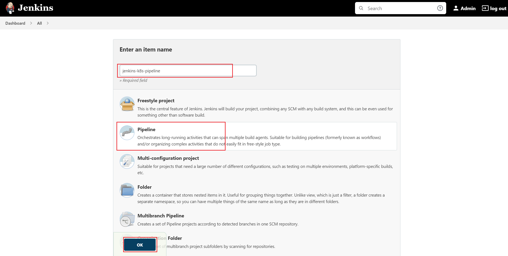

    d. Select "Build Triggers" tab and then select
    **Github hook tirgger for GITScm polling** as shown below:

    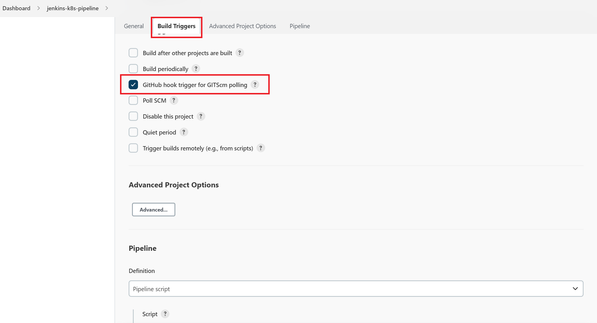

    e. Select "Pipeline" tab and then select the "Pipeline script from SCM" from
    the dropdown options. Then you need to specify the **Git** as SCM and also "Repository
    URL" for your public git repo and also specify your branch and Jenkinsfile's
    name as shown below:

    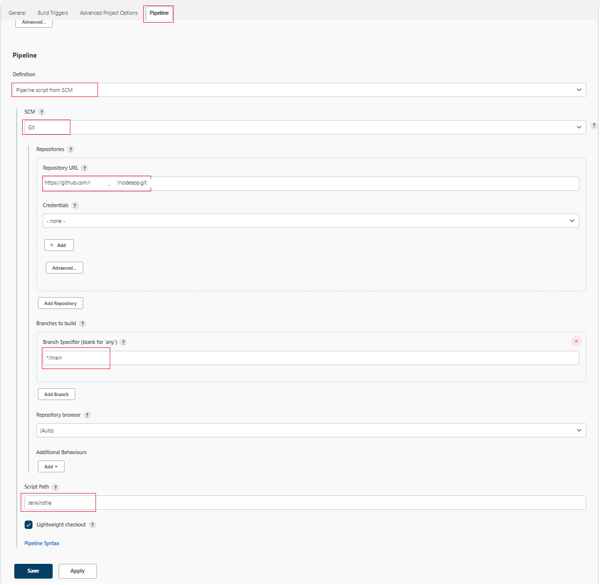

    **OR**, You can copy/paste the content of your Jenkinsfile on the given textbox.
    Please make sure you are selecting the "Pipeline script" from the dropdown options.

    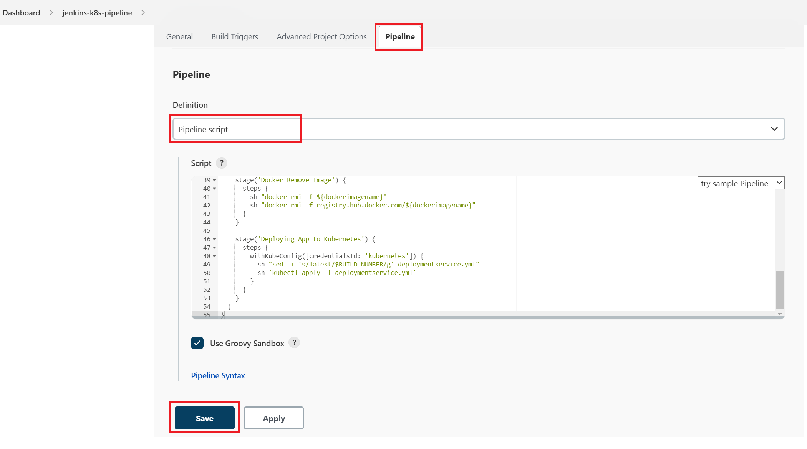

    f. Click on "Save" button.

## How to manually Trigger the Pipeline

- Finally, click on the **"Build Now"** menu link on right side navigation that will
triggers the Pipeline process i.e. Build docker image, Push Image to your Docker
Hub Registry and Pull the image from Docker Registry, Remove local Docker images
and then Deploy to K8s Cluster as shown below:

    

    You can see the deployment to your K8s Cluster is successful then you can browse
    the output using `http://<Floating-IP>:<NodePort>` as shown below:

    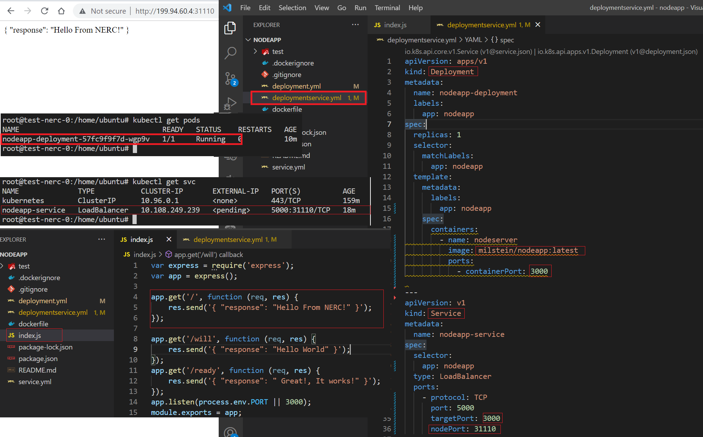

    You can see the Console Output logs of this pipeline process by clicking the
    icon before the id of the started Pipeline on the right bottom corner.

    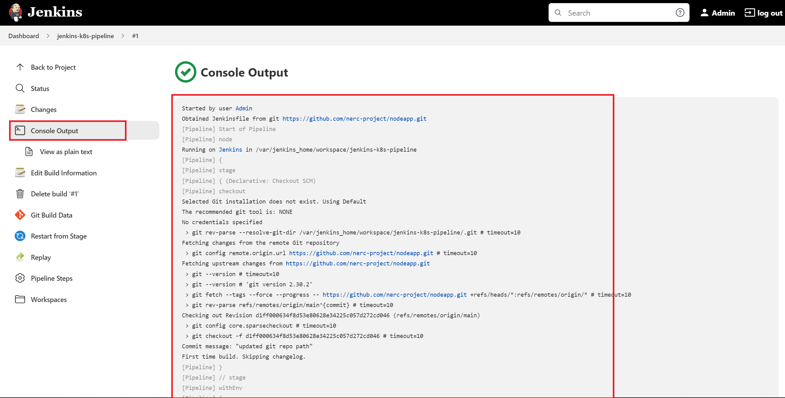

    The pipeline stages after successful completion looks like below:

    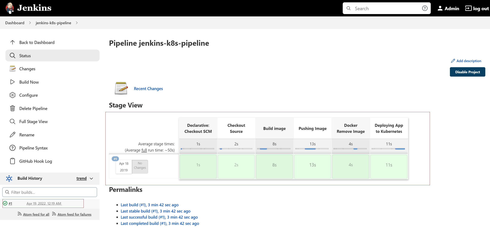

We will continue on [next documentation](integrate-your-GitHub-repository.md) on
how to setup GitHub Webhook in your Jenkins Pipeline so that Jenkins will trigger
the build when a devops commits code to your GitHub repository's specific branch.

---
