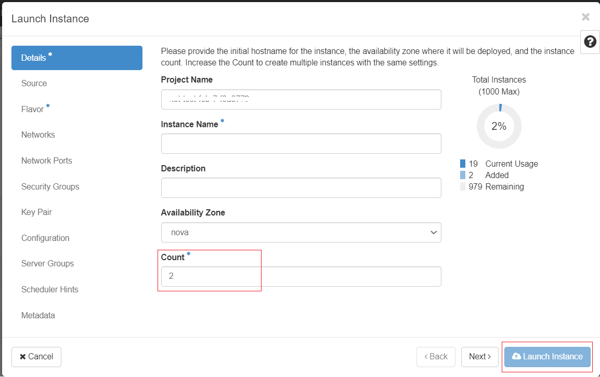
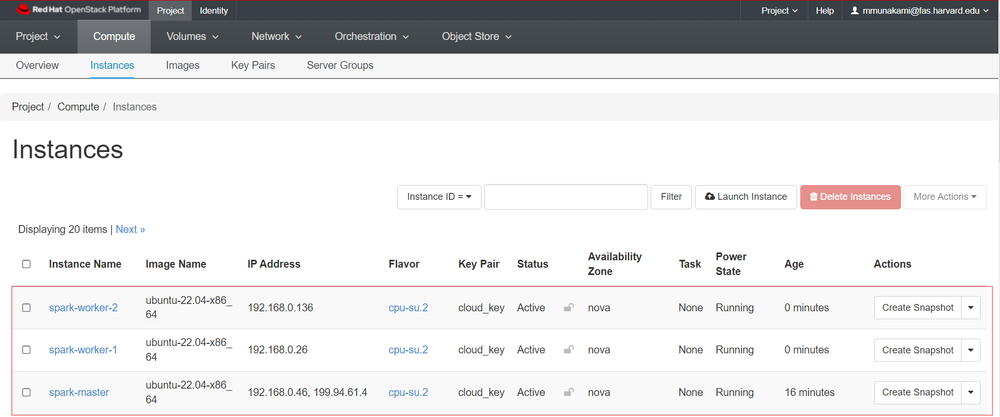
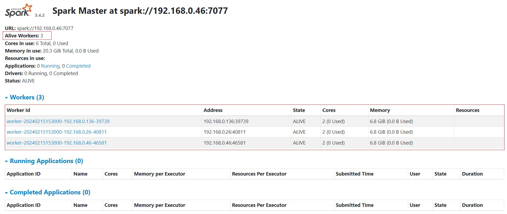
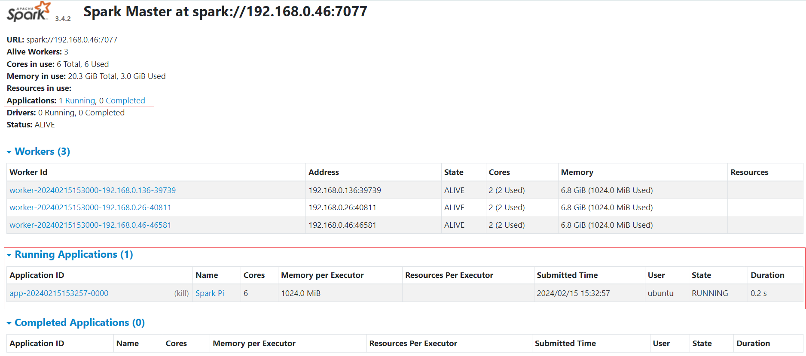
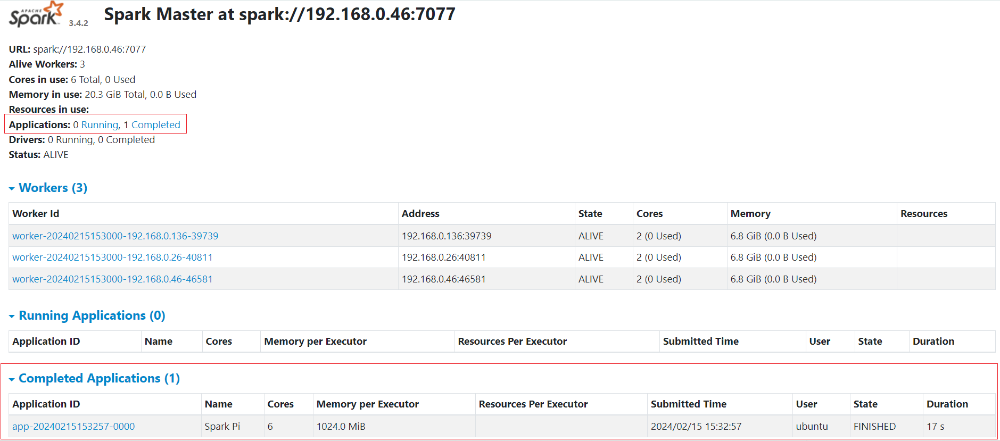

# Apache Spark Cluster Setup on NERC OpenStack

## Apache Spark Overview

[Apache Spark](http://spark.apache.org/) is increasingly recognized as the primary
analysis suite for big data, particularly among Python users. Spark offers a robust
Python API and includes several valuable built-in libraries such as MLlib for
machine learning and Spark Streaming for real-time analysis. In contrast to [Apache
Hadoop](https://hadoop.apache.org/), Spark performs most computations in main
memory boosting the performance.

Many modern computational tasks utilize the MapReduce parallel paradigm. This
computational process comprises two stages: **Map** and **Reduce**. Before task
execution, all data is distributed across the nodes of the cluster. During the
"Map" stage, the master node dispatches the executable task to the other nodes,
and each worker processes its respective data. The subsequent step is "Reduce" that
involves the master node collecting all results from the workers and generating
final results based on the workers' outcomes. Apache Spark also implements this
model of computations so it provides Big Data Processing abilities.

## Apache Spark Cluster Setup

To get a Spark standalone cluster up and running manually, all you need to do is
spawn some VMs and start Spark as master on one of them and worker on the others.
They will automatically form a cluster that you can connect to/from Python, Java,
and Scala applications using the IP address of the master VM.

### Setup a Master VM

- To create a master VM for the first time, ensure that the "Image" dropdown option
  is selected. In this example, we selected **ubuntu-22.04-x86_64** and the `cpu-su.2`
  flavor is being used.

- Make sure you have added rules in the
  [Security Groups](../../openstack/access-and-security/security-groups.md#allowing-ssh)
  to allow **ssh** using Port 22 access to the instance.

- [Assign a Floating IP](../../openstack/create-and-connect-to-the-VM/assign-a-floating-IP.md)
  to your new instance so that you will be able to ssh into this machine:

    ```sh
    ssh ubuntu@<Floating-IP> -A -i <Path_To_Your_Private_Key>
    ```

    For example:

    ```sh
    ssh ubuntu@199.94.61.4 -A -i cloud.key
    ```

- Upon successfully accessing the machine, execute the following dependencies:

    ```sh
    sudo apt-get -y update
    sudo apt install default-jre -y
    ```

- Download and install Scala:

    ```sh
    wget https://downloads.lightbend.com/scala/2.13.10/scala-2.13.10.deb
    sudo dpkg -i scala-2.13.10.deb
    sudo apt-get install scala
    ```

    !!! note "Note"

                    Installing Scala means installing various command-line tools such as the
                    Scala compiler and build tools.

- Download and unpack Apache Spark:

    ```sh
    SPARK_VERSION="3.4.2"
    APACHE_MIRROR="dlcdn.apache.org"

    wget https://$APACHE_MIRROR/spark/spark-$SPARK_VERSION/spark-$SPARK_VERSION-bin-hadoop3-scala2.13.tgz
    sudo tar -zxvf spark-$SPARK_VERSION-bin-hadoop3-scala2.13.tgz
    sudo cp -far spark-$SPARK_VERSION-bin-hadoop3-scala2.13 /usr/local/spark
    ```

    !!! warning "Very Important Note"

                    Please ensure you are using the latest Spark version by modifying the
                    `SPARK_VERSION` in the above script. Additionally, verify that the version
                    exists on the `APACHE_MIRROR` website. Please note the value of `SPARK_VERSION`
                    as you will need it during [Preparing Jobs for Execution and Examination](#preparing-jobs-for-execution-and-examination).

- Create an SSH/RSA Key by running `ssh-keygen -t rsa` without using any passphrase:

    ```sh
    ssh-keygen -t rsa

    Generating public/private rsa key pair.
    Enter file in which to save the key (/home/ubuntu/.ssh/id_rsa):
    Enter passphrase (empty for no passphrase):
    Enter same passphrase again:
    Your identification has been saved in /home/ubuntu/.ssh/id_rsa
    Your public key has been saved in /home/ubuntu/.ssh/id_rsa.pub
    The key fingerprint is:
    SHA256:8i/TVSCfrkdV4+Jyqc00RoZZFSHNj8C0QugmBa7RX7U ubuntu@spark-master
    The key's randomart image is:
    +---[RSA 3072]----+
    |      .. ..o..++o|
    |     o  o.. +o.+.|
    |    . +o  .o=+.oo|
    |     +.oo  +o++..|
    |    o EoS  .+oo  |
    |     . o   .+B   |
    |        .. +O .  |
    |        o.o..o   |
    |         o..     |
    +----[SHA256]-----+
    ```

- Copy and append the contents of **SSH public key** i.e. `~/.ssh/id_rsa.pub` to
  the `~/.ssh/authorized_keys` file.

### Create a Volume Snapshot of the master VM

- Once you're logged in to NERC's Horizon dashboard. You need to **Shut Off** the
  master vm before creating a volume snapshot.

    Click _Action -> Shut Off Instance_.

    Status will change to `Shutoff`.

- Then, create a snapshot of its attached volume by clicking on the "Create snapshot"
  from the _Project -> Volumes -> Volumes_ as [described here](../../openstack/backup/backup-with-snapshots.md#volume-snapshots).

### Create Two Worker Instances from the Volume Snapshot

- Once a snapshot is created and is in "Available" status, you can view and manage
  it under the Volumes menu in the Horizon dashboard under Volume Snapshots.

    Navigate to _Project -> Volumes -> Snapshots_.

- You have the option to directly launch this volume as an instance by clicking
  on the arrow next to "Create Volume" and selecting "Launch as Instance".

    **NOTE:** Specify **Count: 2** to launch 2 instances using the volume snapshot
    as shown below:

    

    !!! note "Naming, Security Group and Flavor for Worker Nodes"

                    You can specify the "Instance Name" as "spark-worker", and for each instance,
                    it will automatically append incremental values at the end, such as
                    `spark-worker-1` and `spark-worker-2`. Also, make sure you have attached
                    the [Security Groups](../../openstack/access-and-security/security-groups.md#allowing-ssh)
                    to allow **ssh** using Port 22 access to the worker instances.

Additionally, during launch, you will have the option to choose your preferred
flavor for the worker nodes, which can differ from the master VM based on your
computational requirements.

- Navigate to _Project -> Compute -> Instances_.

- Restart the shutdown master VM, click _Action -> Start Instance_.

- The final set up for our Spark cluster looks like this, with 1 master node and
  2 worker nodes:

    

### Configure Spark on the Master VM

- SSH login into the master VM again.

- Update the `/etc/hosts` file to specify all three hostnames with their corresponding
  internal IP addresses.

    ```sh
    sudo nano /etc/hosts
    ```

    Ensure all hosts are resolvable by adding them to `/etc/hosts`. You can modify
    the following content specifying each VM's internal IP addresses and paste
    the updated content at the end of the `/etc/hosts` file. Alternatively, you
    can use `sudo cat >> /etc/hosts` to append the content directly to the end of
    the `/etc/hosts` file.

    ```sh
    <Master-Internal-IP> master
    <Worker1-Internal-IP> worker1
    <Worker2-Internal-IP> worker2
    ```

    !!! danger "Very Important Note"

                    Make sure to use `>>` instead of `>` to avoid overwriting the existing content
                    and append the new content at the end of the file.

    For example, the end of the `/etc/hosts` file looks like this:

    ```sh
    sudo cat /etc/hosts
    ...
    192.168.0.46 master
    192.168.0.26 worker1
    192.168.0.136 worker2
    ```

- Verify that you can SSH into both worker nodes by using `ssh worker1` and
  `ssh worker2` from the Spark master node's terminal.

- Copy the sample configuration file for the Spark:

    ```sh
    cd /usr/local/spark/conf/
    cp spark-env.sh.template spark-env.sh
    ```

- Update the environment variables file i.e. `spark-env.sh` to include the following
  information:

    ```sh
    export SPARK_MASTER_HOST='<Master-Internal-IP>'
    export JAVA_HOME=<Path_of_JAVA_installation>
    ```

    !!! tip "Environment Variables"

                    Executing this command: `readlink -f $(which java)` will display the path
                    to the current Java setup in your VM. For example:
                    `/usr/lib/jvm/java-11-openjdk-amd64/bin/java`, you need to remove the
                    last `bin/java` part, i.e. `/usr/lib/jvm/java-11-openjdk-amd64`, to set
                    it as the `JAVA_HOME` environment variable.
                    Learn more about other Spark settings that can be configured through environment
                    variables [here](https://spark.apache.org/docs/3.4.2/configuration.html#environment-variables).

    For example:

    ```sh
    echo "export SPARK_MASTER_HOST='192.168.0.46'" >> spark-env.sh
    echo "export JAVA_HOME=/usr/lib/jvm/java-11-openjdk-amd64" >> spark-env.sh
    ```

- Source the changed environment variables file i.e. `spark-env.sh`:

    ```sh
    source spark-env.sh
    ```

- Create a file named `slaves` in the Spark configuration directory (i.e.,
  `/usr/local/spark/conf/`) that specifies all 3 hostnames (nodes) as specified
  in `/etc/hosts`:

    ```sh
    sudo cat slaves
    master
    worker1
    worker2
    ```

## Run the Spark cluster from the Master VM

- SSH into the master VM again if you are not already logged in.

- You need to run the Spark cluster from `/usr/local/spark`:

    ```sh
    cd /usr/local/spark

    # Start all hosts (nodes) including master and workers
    ./sbin/start-all.sh
    ```

    !!! info "How to Stop All Spark Cluster"

                    To stop all of the Spark cluster nodes, execute `./sbin/stop-all.sh`
                    command from `/usr/local/spark`.

## Connect to the Spark WebUI

Apache Spark provides a suite of
[web user interfaces (WebUIs)](https://spark.apache.org/docs/latest/web-ui.html)
that you can use to monitor the status and resource consumption of your Spark cluster.

!!! info "Different types of Spark Web UI"

    Apache Spark provides different web UIs: **Master web UI**, **Worker web UI**,
    and **Application web UI**.

- You can connect to the **Master web UI** using
  [SSH Port Forwarding, aka SSH Tunneling](https://www.ssh.com/academy/ssh/tunneling-example)
  i.e. **Local Port Forwarding** from your local machine's terminal by running:

    ```sh
    ssh -N -L <Your_Preferred_Port>:localhost:8080 <User>@<Floating-IP> -i <Path_To_Your_Private_Key>
    ```

    Here, you can choose any port that is available on your machine as `<Your_Preferred_Port>`
    and then master VM's assigned Floating IP as `<Floating-IP>` and associated
    Private Key pair attached to the VM as `<Path_To_Your_Private_Key>`.

    For example:

    ```sh
    ssh -N -L 8080:localhost:8080 ubuntu@199.94.61.4 -i ~/.ssh/cloud.key
    ```

- Once the SSH Tunneling is successful, please do not close or stop the terminal
  where you are running the SSH Tunneling. Instead, log in to the Master web UI
  using your web browser: `http://localhost:<Your_Preferred_Port>` i.e. `http://localhost:8080`.

The Master web UI offers an overview of the Spark cluster, showcasing the following
details:

- Master URL and REST URL
- Available CPUs and memory for the Spark cluster
- Status and allocated resources for each worker
- Details on active and completed applications, including their status, resources,
  and duration
- Details on active and completed drivers, including their status and resources

The Master web UI appears as shown below when you navigate to `http://localhost:<Your_Preferred_Port>`
i.e. `http://localhost:8080` from your web browser:



The Master web UI also provides an overview of the applications. Through the
Master web UI, you can easily identify the allocated vCPU (Core) and memory
resources for both the Spark cluster and individual applications.

## Preparing Jobs for Execution and Examination

- To run jobs from `/usr/local/spark`, execute the following commands:

    ```sh
    cd /usr/local/spark
    SPARK_VERSION="3.4.2"
    ```

    !!! warning "Very Important Note"

                    Please ensure you are using the same Spark version that you have
                    [downloaded and installed previously](#setup-a-master-vm) as the value
                    of `SPARK_VERSION` in the above script.

- **Single Node Job:**

    Let's quickly start to run a simple job:

    ```sh
    ./bin/spark-submit --driver-memory 2g --class org.apache.spark.examples.SparkPi examples/jars/spark-examples_2.13-$SPARK_VERSION.jar 50
    ```

- **Cluster Mode Job:**

    Let's submit a longer and more complex job with many tasks that will be
    distributed among the multi-node cluster, and then view the Master web UI:

    ```sh
    ./bin/spark-submit --class org.apache.spark.examples.SparkPi --master spark://master:7077 examples/jars/spark-examples_2.13-$SPARK_VERSION.jar 1000
    ```

    While the job is running, you will see a similar view on the Master web UI under
    the "Running Applications" section:

    

    Once the job is completed, it will show up under the "Completed Applications"
    section on the Master web UI as shown below:

    

---
